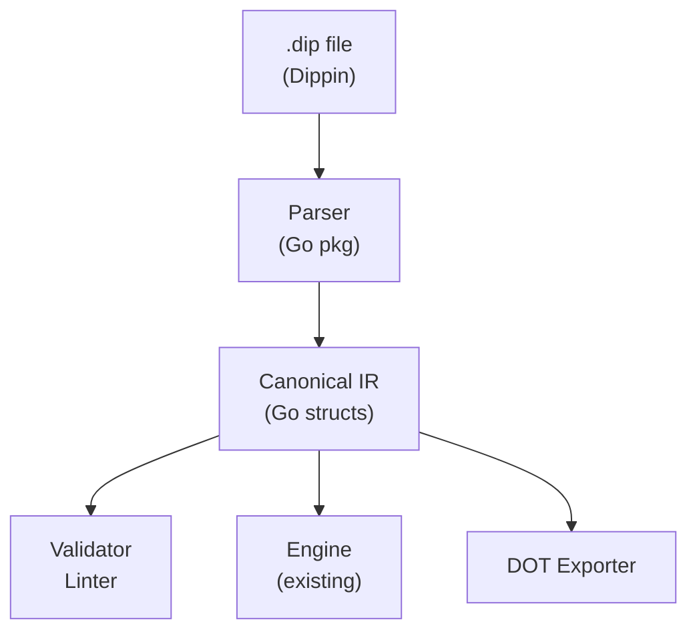

# Dippin: Design Plan

A repo-grounded engineering plan for replacing DOT as the authoring format for Tracker pipelines.

---

## 1. Executive Summary

Tracker is a production Go pipeline engine that executes AI-driven workflows defined as Graphviz DOT graphs. DOT was a pragmatic starting point — graph-native, visual, widely tooled — but it's now carrying too much weight: prompts, model configuration, branching logic, retry semantics, CSS-like stylesheets, and shell scripts are all stuffed into DOT string attributes.

**Dippin** replaces DOT as the authoring format while keeping DOT as an export target. The architecture is:

```
Dippin source → Parser → Canonical IR → Execution Engine
                                      → DOT Export (visualization)
                                      → Linter / Validator
```

This plan proposes a concrete syntax (two candidates evaluated), a canonical IR, a composition model, tooling strategy, and phased migration path. Every recommendation is grounded in the actual Tracker codebase and the real dotpowers pipelines.

---

## 2. What Tracker Actually Does Today

### The execution model in one paragraph

Tracker parses a DOT file into a `Graph` of `Node` and `Edge` structs. Each node's DOT shape maps to a handler name (`box` → `codergen`, `hexagon` → `wait.human`, etc.). The engine walks the graph from `Mdiamond` (start) to `Msquare` (exit), executing each node's handler. Handlers return an `Outcome` with status (`success`/`fail`/`retry`), context updates (key-value strings), and edge routing hints (`PreferredLabel`, `SuggestedNextNodes`). The engine selects the next edge via a priority cascade: condition match → preferred label → suggested nodes → weight → lexical. Context is a shared `map[string]string` threaded through all nodes. Checkpoints serialize the full state after each step.

### Key data structures (actual code)

```go
// Graph: flat collection, not hierarchical
type Graph struct {
    Name, StartNode, ExitNode string
    Nodes map[string]*Node
    Edges []*Edge
    Attrs map[string]string  // graph-level config
}

// Node: identity + display + handler + untyped attrs bag
type Node struct {
    ID, Shape, Label, Handler string
    Attrs map[string]string
}

// Edge: connection + optional condition + untyped attrs bag
type Edge struct {
    From, To, Label, Condition string
    Attrs map[string]string
}

// Outcome: what a handler returns
type Outcome struct {
    Status             string            // "success" | "fail" | "retry"
    ContextUpdates     map[string]string
    PreferredLabel     string
    SuggestedNextNodes []string
    Stats              *SessionStats
}
```

### What context actually flows

Pipeline context is `map[string]string` with reserved keys:
- `outcome` — last node status
- `last_response` — LLM response text
- `human_response` — human gate input
- `tool_stdout` / `tool_stderr` — shell output
- `preferred_label` — edge routing hint
- `graph.*` — graph-level attrs auto-injected

There is no schema, no typing, no contract enforcement. Nodes read whatever keys they want and write whatever they want. This works because pipelines are hand-authored and context key names are convention.

---

## 3. What DOT Is Doing Well vs Badly

### What DOT does well

| Strength | Why it matters |
|----------|---------------|
| **Graph-native syntax** | Nodes and edges are first-class; topology is immediately visible |
| **Graphviz rendering** | `dot -Tpng pipeline.dot` gives instant visualization |
| **Familiar** | Many developers know DOT basics |
| **Flexible attributes** | Arbitrary key=value pairs on any element |
| **Tooling ecosystem** | Editors, renderers, layout engines all exist |

### What DOT does badly (grounded in actual files)

#### 3.1 Prompt stuffing

Every LLM node crams its entire prompt into a single DOT attribute string:

```dot
ExploreIdea [shape=box, prompt="## IRON LAW: NO PRODUCTION CODE WITHOUT A FAILING TEST FIRST\nWrite code before the test? Delete it. Start over.\n\n## Context\nYou are working in `run.working_dir`.\n\n## Task\nRead all project files..."]
```

In `dotpowers.dot`, prompts are 30+ lines encoded as a single `prompt="..."` attribute. Newlines are `\n` literals. Embedded quotes require `\"`. This is unreadable, un-diffable, and hostile to LLMs trying to edit prompts.

#### 3.2 Shell scripts in string attributes

Tool nodes encode shell scripts as single-line strings:

```dot
CheckPlan [shape=parallelogram, tool_command="#!/bin/sh\nset -eu\nif [ -f docs/plans/plan.md ] && grep -q '^- \\[ \\] task-[0-9]\\+:' \"$PLAN\"; then\n  printf 'has_tasks'\nelse\n  printf 'no_tasks'\nfi"]
```

Triple escaping (`\\[` for literal `[` in regex inside `\"` inside DOT quotes) makes these nearly impossible to author or debug correctly.

#### 3.3 Metadata overload on shape

DOT shape is doing triple duty: (1) visual rendering hint, (2) handler dispatch key, (3) semantic node type. Plus special cases — a `diamond` with `tool_command` becomes a tool handler, a `diamond` with `prompt` becomes codergen with `auto_status=true`. This coupling means you can't change visualization without changing semantics and vice versa.

#### 3.4 No composition or reuse

There is no import/include/module system. `dotpowers.dot` is 1,199 lines in a single file. Common patterns (parallel review → cross-critique → consensus) are copy-pasted across files. The only "subgraph" support requires a separate parsed graph passed via a Go map at construction time, not referenced from DOT syntax.

#### 3.5 Condition expressions are opaque strings

```dot
condition="context.tool_stdout!=all_complete && context.tool_stdout!=no_tasks_found"
```

These are mini-programs inside attribute values. No syntax highlighting, no validation at parse time, no autocompletion. Typos in variable names silently evaluate to empty string.

#### 3.6 CSS-in-DOT stylesheets

```dot
model_stylesheet="* { llm_model: claude-opus-4-6; } .implement { llm_model: gpt-5.4; }"
```

A custom CSS-like language embedded in a DOT attribute string. Useful concept, terrible ergonomics.

#### 3.7 No validation feedback

DOT parsing via gographviz accepts any attribute. There is no schema validation. Typo `llm_modle` instead of `llm_model`? Silently ignored, falls back to graph default. Wrong fidelity value? Silently falls back to `FidelityFull`. The validate command only checks graph structure (reachability, cycles, start/exit nodes), not semantic correctness.

#### 3.8 State flow is invisible

Context keys are convention. Nothing in the syntax tells you that `PickNextTask` writes `tool_stdout` and `ImplementTask` reads `last_response`. State dependencies between nodes are implicit in prompt text and tool scripts.

#### 3.9 No good way for LLMs to edit

An LLM trying to modify a node in a DOT file must:
1. Parse the surrounding DOT syntax
2. Find the right attribute in a multi-line attribute list
3. Edit a string value that may contain escaped newlines, quotes, and shell syntax
4. Avoid breaking DOT quoting rules

This is error-prone. LLMs regularly break DOT escaping.

---

## 4. Semantic Model That Must Survive

These are the **true semantics** extracted from the codebase — things Dippin must represent:

### 4.1 Node kinds (handler semantics)

| Kind | What it does | Must survive |
|------|-------------|-------------|
| `agent` (codergen) | LLM call with tools, agentic loop | Yes — core value |
| `human` (wait.human) | Pause for human input (choice or freeform) | Yes — core value |
| `tool` | Execute shell command | Yes — core value |
| `conditional` | No-op decision point; engine evaluates outgoing edges | No — deferred from v1. Routing handled by conditional edges directly. See §8.3. |
| `parallel` | Fan-out to concurrent branches | Yes |
| `fan_in` | Join parallel branches | Yes |
| `start` / `exit` | Entry/exit terminals | Yes, but explicit declaration, not shape-based |
| `subgraph` | Embed sub-pipeline | Yes — needs improvement |
| `manager_loop` | Placeholder (currently no-op) | No — remove until real semantics exist |

### 4.2 Edge semantics

- **Unconditional**: default flow
- **Conditional**: boolean expression evaluated against context
- **Labeled**: human-readable name, used for human gate choices and edge selection
- **Weighted**: priority hint for edge selection among unconditional edges
- **Restart**: back-edge that triggers downstream clearing and re-execution (see §4.3)

### 4.3 Execution semantics

- **Sequential by default**: one node at a time, walk the graph
- **Parallel via explicit fan-out/fan-in**: component → branches → tripleoctagon
- **Retry with policy**: named policies (standard, aggressive, patient, linear, none), per-node or graph-level max, backoff functions, retry targets, fallback targets
- **Loop restart**: when an edge targets an already-completed node, clear downstream and restart (bounded by `max_restarts`)
- **Goal gates**: certain nodes are "goal gates" — if they fail, the pipeline fails even at exit
- **Checkpoint/resume**: serialize full state after each node, restore with fidelity degradation

#### Loop/restart runtime semantics (precise specification)

This is one of the most implementation-critical behaviors and must be brutally explicit:

1. **Back-edge detection**: When `selectEdge()` resolves to a target node that is already in the checkpoint's `completedSet`, the engine treats this as a loop restart.

2. **Restart counter**: The engine increments `cp.RestartCount` (global, not per-edge). If `RestartCount >= max_restarts` (graph attr, default 5), the pipeline fails with `EventPipelineFailed`.

3. **Downstream clearing**: The engine calls `clearDownstream(targetNode)` which:
   - BFS from target node through all outgoing edges
   - Removes each reachable node from `cp.CompletedNodes`
   - Clears retry counts for each removed node (fresh budgets)
   - Does NOT clear context — all context key-values survive

4. **Context preservation**: Context is fully preserved across restarts. The restarting node sees all context from the previous iteration. This is intentional — it enables iterative refinement (e.g., review feedback feeds back into implementation).

5. **Restart target override**: If `graph.Attrs["restart_target"]` is set, the engine jumps there instead of the edge's target.

6. **Checkpoint behavior**: After clearing downstream, the engine saves a checkpoint at the new current position. If the process crashes during restart, it resumes from the restart point, not the original edge source.

7. **Subgraph interaction (current Tracker behavior)**: In the current engine, subgraph engines have their own `RestartCount`, independent from the parent. **In Dippin v1**, subgraphs are expanded inline at compile time (see §12), so there are no runtime subgraph boundaries. Restart counters are global within the expanded workflow. If runtime subgraph isolation becomes a real need post-v1, it can be added as an execution mode later.

8. **Stats**: Node-local `SessionStats` (turns, tool calls, etc.) are NOT preserved across restarts. Each re-execution of a node produces fresh stats. The trace accumulates entries for every execution (including re-executions).

### 4.4 Context model

- `map[string]string` shared state
- Handlers write via `ContextUpdates`
- Reserved keys for outcome, responses, tool output
- Graph-level attrs auto-injected with `graph.` prefix
- Prompt variable expansion (`$goal`)
- Context injection (append prior outputs to prompts)
- Fidelity-based compaction for long-running pipelines

### 4.5 LLM configuration

- Per-node model and provider override
- Graph-level defaults
- CSS-like stylesheet with selectors (*, shape, .class, #id)
- Reasoning effort levels
- System prompts
- Max turns, command timeout, cache, compaction settings

---

## 5. Legacy Hacks That Should Die

| Current behavior | Why it's a hack | What should replace it |
|-----------------|-----------------|----------------------|
| Shape → handler mapping | Couples visuals to semantics | Explicit `kind:` field |
| Diamond + tool_command → tool handler | Special-case dispatch | Explicit kind |
| Diamond + prompt → codergen + auto_status | Invisible behavior change | Explicit kind + explicit auto_status |
| `\n` encoding in prompts | DOT string limitation | Multiline block syntax |
| Shell scripts in `tool_command` attribute | Unreadable, triple-escaping | Heredoc-style blocks or file references |
| `model_stylesheet` as DOT attribute string | CSS-in-a-string-in-a-string | Top-level stylesheet block (v1.5) or explicit per-node fields (v1) |
| `manager_loop` handler | No-op placeholder | Remove; re-add when designed |
| `Mdiamond`/`Msquare` as start/exit | DOT shape convention | Explicit `start:` / `exit:` declaration |
| Attribute-bag node config | No schema, no validation | Typed fields per node kind |
| `context.tool_stdout` in conditions | Magic variable names, no namespace | Namespaced references: `ctx.tool_stdout` |
| `parallel.results` as JSON in context string | Structured data in flat string map | First-class parallel result model |
| First-node-is-start convention | Reordering file changes semantics | Explicit `start:` declaration |

---

## 6. Recommended Architecture



**Key property**: The existing engine (`pipeline.Engine`) continues to operate on the IR. The parser is a new frontend. The DOT exporter is a new backend. The engine itself needs minimal changes — mainly accepting IR structs instead of (or in addition to) DOT-parsed structs.

### Migration bridge

During migration, both paths exist:
- `.dip` → Dippin Parser → IR → Engine
- `.dot` → DOT Parser (existing) → IR adapter → Engine

The IR adapter is a thin function that converts `pipeline.Graph` to the new IR types.

---

## 7. Canonical IR Proposal

The IR is the contract between parsing and execution. It must be explicit, normalized, and independent of both Dippin syntax and DOT syntax.

### Type-safe node model

Instead of a single mega-struct for all node kinds, the IR uses a discriminated config union. This makes validation, formatting, and future evolution cleaner:

```go
package ir

// Workflow is the top-level IR structure.
type Workflow struct {
    Name        string
    Version     string            // Dippin format version
    Goal        string            // Human-readable objective
    Start       string            // Explicit entry node ID (required)
    Exit        string            // Explicit exit node ID (required)
    Defaults    WorkflowDefaults  // Graph-level config
    Nodes       []*Node           // Ordered for deterministic processing
    Edges       []*Edge
    SourceMap   *SourceMap        // File/line mapping for diagnostics
}

type WorkflowDefaults struct {
    Model         string        // Default LLM model
    Provider      string        // Default LLM provider
    RetryPolicy   string        // Default retry policy name
    MaxRetries    int           // Default max retries
    Fidelity      string        // Default fidelity level
    MaxRestarts   int           // Max loop restarts (default 5)
    RestartTarget string        // Where to restart on loop
    CacheTools    bool          // Cache tool results
    Compaction    string        // Context compaction mode
}

// NodeKind enumerates node types explicitly.
type NodeKind string
const (
    NodeAgent     NodeKind = "agent"
    NodeHuman     NodeKind = "human"
    NodeTool      NodeKind = "tool"
    NodeParallel  NodeKind = "parallel"
    NodeFanIn     NodeKind = "fan_in"
    NodeSubgraph  NodeKind = "subgraph"
)

// Node represents a single step in the workflow.
type Node struct {
    ID      string
    Kind    NodeKind
    Label   string        // Human-readable display name
    Classes []string      // For stylesheet matching (v1.5)
    Config  NodeConfig    // Kind-specific configuration
    Retry   RetryConfig   // Retry behavior
    IO      NodeIO        // Declared inputs/outputs (advisory in v1)
    Source  SourceLocation
}

// NodeConfig is one of the kind-specific config types.
type NodeConfig interface{ nodeConfig() }

type AgentConfig struct {
    Prompt              string
    SystemPrompt        string
    Model               string    // Per-node override
    Provider            string
    MaxTurns            int
    CmdTimeout          Duration
    CacheTools          bool
    Compaction          string
    CompactionThreshold float64
    ReasoningEffort     string
    Fidelity            string
    AutoStatus          bool      // Parse STATUS: from response
    GoalGate            bool      // Pipeline fails if this node fails
}

type HumanConfig struct {
    Mode    string    // "choice" | "freeform"
    Default string    // Default choice
}

type ToolConfig struct {
    Command string    // Shell command (multiline OK)
    Timeout Duration
}

type ParallelConfig struct {
    Targets []string  // Fan-out target node IDs
}

type FanInConfig struct {
    Sources []string  // Source node IDs to join
}

type SubgraphConfig struct {
    Ref    string            // Workflow name or path
    Params map[string]string // Parameter overrides
}

// RetryConfig is shared across all node kinds.
type RetryConfig struct {
    Policy         string  // Named policy: "standard", "aggressive", etc.
    MaxRetries     int     // Override default
    RetryTarget    string  // Node to jump to on retry
    FallbackTarget string  // Fallback if retries exhausted
}

// NodeIO declares what context keys a node reads and writes.
// Advisory in v1 — validated as warnings, not errors.
type NodeIO struct {
    Reads  []string  // Context keys this node expects
    Writes []string  // Context keys this node produces
}
```

### Edge and condition types

```go
// Edge represents a connection between nodes.
type Edge struct {
    From      string
    To        string
    Label     string          // Display label / human choice text
    Condition *Condition      // Parsed condition (not raw string)
    Weight    int             // Priority hint
    Restart   bool            // Back-edge: triggers downstream clear + re-execution
    Source    SourceLocation
}

// Condition is a parsed, validated boolean expression.
type Condition struct {
    Raw    string        // Original source text
    Parsed ConditionExpr // AST for evaluation
}

// ConditionExpr is the AST for edge conditions.
type ConditionExpr interface{ conditionExpr() }
type CondAnd     struct{ Left, Right ConditionExpr }
type CondOr      struct{ Left, Right ConditionExpr }
type CondNot     struct{ Inner ConditionExpr }
type CondCompare struct {
    Variable string   // Namespaced: "ctx.outcome", "graph.goal", etc.
    Op       string   // "=", "!=", "contains", "startswith", "endswith", "in"
    Value    string
}

// SourceLocation for diagnostics.
type SourceLocation struct {
    File      string
    Line      int
    Column    int
    EndLine   int
    EndColumn int
}

type SourceMap struct {
    Entries []SourceMapEntry
}
type SourceMapEntry struct {
    IRElement string // "node:MyNode", "edge:A->B"
    Location  SourceLocation
}
```

### IR properties

- **Explicit**: No shape→handler mapping. `Kind` is the kind. Start/exit are named fields, not inferred.
- **Type-safe**: Each node kind has its own config struct. Invalid field combinations are structurally impossible.
- **Normalized**: Conditions are parsed ASTs, not raw strings. Variables are namespace-qualified.
- **Independent**: No DOT shapes, no Dippin syntax details.
- **Diagnosable**: Source locations on every node and edge.
- **Serializable**: Can be JSON-encoded for debugging/tooling.

### Adapting existing engine

The existing `pipeline.Graph` can be mechanically converted to `ir.Workflow`:

```go
func GraphToIR(g *pipeline.Graph) *ir.Workflow {
    // Node.Handler → ir.NodeKind
    // Node.Attrs → typed config structs per kind
    // Edge.Condition → parsed ir.Condition
    // Graph.Attrs → ir.WorkflowDefaults
    // Graph.StartNode → Workflow.Start
    // Graph.ExitNode → Workflow.Exit
}
```

The engine can then be incrementally migrated to accept `ir.Workflow` directly, or a reverse adapter `ir.Workflow → pipeline.Graph` can be used during transition.

---

## 8. Dippin Syntax Proposal A: "Indented Graph"

Design principles: graph-native, indentation-structured, minimal punctuation, multiline blocks with heredoc-style delimiters.

### Example: ask-and-execute pipeline

```dippin
workflow ask_and_execute
  goal: "Ask user for a task, implement it, review, ship"
  start: AskUser
  exit: Done

  defaults
    model: claude-opus-4-6
    provider: anthropic
    retry_policy: standard
    fidelity: summary:high

  # ── Phase 1: Gather ──────────────────────────────

  human AskUser
    label: "What would you like to build?"
    mode: freeform

  agent Interpret
    label: "Interpret the request"
    reads: human_response
    writes: plan
    prompt:
      You are a senior software architect.

      Read the user's request below and produce a clear,
      actionable implementation plan.

      ## User Request
      ${ctx.human_response}

  # ── Phase 2: Implement (parallel) ────────────────

  parallel ImplementFanOut -> ImplementClaude, ImplementCodex, ImplementGemini

  agent ImplementClaude
    label: "Implement (Claude)"
    model: gpt-5.4
    provider: openai
    reads: last_response
    prompt:
      Implement the plan from the previous step.
      ${ctx.last_response}

  agent ImplementCodex
    label: "Implement (Codex)"
    model: gpt-5.3-codex
    provider: openai
    reads: last_response
    prompt:
      Implement the plan from the previous step.
      ${ctx.last_response}

  agent ImplementGemini
    label: "Implement (Gemini)"
    model: gemini-3.5-flash
    provider: gemini
    reads: last_response
    prompt:
      Implement the plan from the previous step.
      ${ctx.last_response}

  fan_in ImplementJoin <- ImplementClaude, ImplementCodex, ImplementGemini

  # ── Phase 3: Review ──────────────────────────────

  agent Validate
    label: "Validate implementation"
    goal_gate: true
    auto_status: true
    max_retries: 2
    reads: last_response
    prompt:
      Review the implementations. Run tests.
      Respond with STATUS: success or STATUS: fail.

  human Approve
    label: "Ship it?"
    default: "Yes"

  # ── Edges ─────────────────────────────────────────

  edges
    AskUser -> Interpret
    Interpret -> ImplementFanOut
    ImplementJoin -> Validate
    Validate -> Approve          when ctx.outcome = success
    Validate -> Interpret        when ctx.outcome = fail     label: "retry"  restart: true
    Approve -> Done
```

### Syntax rules

1. **Workflow declaration**: `workflow <name>` at top level
2. **Explicit entry/exit**: `start: <NodeID>` and `exit: <NodeID>` are required fields on the workflow. No inference from declaration order.
3. **Blocks**: `defaults`, `edges` are top-level sections
4. **Nodes**: `<kind> <ID>` starts a node block; indented lines are fields
5. **Fields**: `key: value` — simple values on one line
6. **Multiline values**: `key:` followed by indented block (no quotes needed)
7. **Edges**: `A -> B` with optional `when <condition>`, `label: "text"`, and `restart: true`
8. **Parallel**: `parallel <ID> -> target1, target2, ...`
9. **Fan-in**: `fan_in <ID> <- source1, source2, ...`
10. **Comments**: `#` line comments
11. **Section headers**: `# ── text ──` for visual grouping (ignored by parser)
12. **Variables**: `${namespace.key}` in prompts for context interpolation (see §8.2)
13. **Conditions**: `when <expr>` on edges using namespaced variables
14. **I/O declarations**: `reads:` and `writes:` for advisory context contracts
15. **Route sugar**: Deferred from v1. See §8.3.

### 8.1 Multiline content

Prompts are just indented text blocks after `prompt:`. No escaping needed:

```dippin
  agent MyNode
    prompt:
      You are a code reviewer.

      ## Rules
      - Check for bugs
      - Check for security issues
      - Run `pytest` to validate

      ## Context
      ${ctx.last_response}
```

The indentation of the first content line sets the baseline. All content is dedented by that amount. Empty lines are preserved. No quotes. No escaping. Diffable line-by-line.

Tool command blocks work identically:

```dippin
  tool CheckTests
    label: "Run test suite"
    timeout: 60s
    command:
      #!/bin/sh
      set -eu
      if pytest --tb=short 2>&1; then
        printf 'pass'
      else
        printf 'fail'
        exit 1
      fi
```

### 8.2 Context variable namespaces

All variable references use explicit namespaces, even though the engine still uses a flat `map[string]string` underneath. This makes authoring clearer and diagnostics much better.

| Namespace | What it contains | Examples |
|-----------|-----------------|----------|
| `ctx.` | Runtime context (handler outputs, reserved keys) | `ctx.outcome`, `ctx.last_response`, `ctx.tool_stdout` |
| `graph.` | Workflow-level attributes | `graph.goal` |
| `params.` | Module parameters (composition) | `params.model`, `params.strict` |

**Lowering**: At IR → engine boundary, namespaces are stripped to flat keys. `ctx.outcome` → `outcome`, `graph.goal` → `graph.goal` (already prefixed in current engine), `params.strict` → substituted at expansion time.

**Validation tiers**:
- **Always-known variables** (`ctx.outcome`, `ctx.last_response`, `ctx.human_response`, `ctx.tool_stdout`, `ctx.tool_stderr`, `graph.goal`): validated at parse time, error if misspelled.
- **Declared outputs** (from `writes:` on upstream nodes): validated as warnings if referenced but not declared.
- **Dynamic variables** (everything else): warning-only. Never an error unless it matches no known pattern at all.

### 8.3 Route syntax sugar (deferred from v1)

Route sugar is **deferred from v1**. In v1, all conditional routing is expressed as conditional edges in the `edges` block:

```dippin
  edges
    Validate -> Approve     when ctx.outcome = success
    Validate -> Interpret   when ctx.outcome = fail     restart: true
    Validate -> HumanHelp   when ctx.outcome = retry
```

This avoids ambiguity about whether `route Validate` attaches routing to an existing node, declares a new node, or replaces edge declarations. If route sugar is added post-v1, it should use unambiguous syntax like `route after <NodeID>` to make clear it decorates an existing node's outgoing edges. The IR does not include a `NodeCondition` kind — there is no intermediate condition node, just edges with conditions.

---

## 9. Dippin Syntax Proposal B: "Declarative YAML-Adjacent"

Design principles: explicit structure, no significant whitespace for control flow, uses `---` delimiters, closer to structured config.

### Example: same pipeline

```dippin
---
workflow: ask_and_execute
goal: "Ask user for a task, implement it, review, ship"
start: AskUser
exit: Done

defaults:
  model: claude-opus-4-6
  provider: anthropic
  retry_policy: standard
  fidelity: summary:high

---
# Phase 1: Gather

- human: AskUser
  label: "What would you like to build?"
  mode: freeform

- agent: Interpret
  label: "Interpret the request"
  prompt: |
    You are a senior software architect.

    Read the user's request below and produce a clear,
    actionable implementation plan.

    ## User Request
    ${ctx.human_response}

---
# Phase 2: Implement (parallel)

- parallel: ImplementFanOut
  targets: [ImplementClaude, ImplementCodex, ImplementGemini]

- agent: ImplementClaude
  label: "Implement (Claude)"
  model: gpt-5.4
  provider: openai
  prompt: |
    Implement the plan from the previous step.
    ${ctx.last_response}

- agent: ImplementCodex
  label: "Implement (Codex)"
  model: gpt-5.3-codex
  provider: openai
  prompt: |
    Implement the plan from the previous step.
    ${ctx.last_response}

- agent: ImplementGemini
  label: "Implement (Gemini)"
  model: gemini-3.5-flash
  provider: gemini
  prompt: |
    Implement the plan from the previous step.
    ${ctx.last_response}

- fan_in: ImplementJoin
  sources: [ImplementClaude, ImplementCodex, ImplementGemini]

---
# Phase 3: Review

- agent: Validate
  label: "Validate implementation"
  goal_gate: true
  auto_status: true
  max_retries: 2
  prompt: |
    Review the implementations. Run tests.
    Respond with STATUS: success or STATUS: fail.

- human: Approve
  label: "Ship it?"
  default: "Yes"

---
edges:
  - AskUser -> Interpret
  - Interpret -> ImplementFanOut
  - ImplementJoin -> Validate
  - Validate -> Approve:
      when: ctx.outcome = success
  - Validate -> Interpret:
      when: ctx.outcome = fail
      restart: true
      label: retry
  - Approve -> Done
```

### Key differences from Proposal A

- Uses `---` document separators for sections (phases)
- Node declarations use `- kind: ID` list syntax
- Multiline strings use `|` (YAML pipe) indicator
- Edges section uses list with optional nested attributes
- No `route` sugar (conditions only in edges)

---

## 10. Comparison of A vs B

| Criterion | A: Indented Graph | B: YAML-Adjacent | Winner |
|-----------|-------------------|-------------------|--------|
| **Human readability** | Clean, low noise, graph structure obvious | More verbose, familiar to YAML users | A |
| **LLM generation reliability** | Simple rules: indent = nesting, `kind ID` starts nodes | YAML-like but not YAML — risk of LLMs producing invalid YAML | A |
| **Parser simplicity** | Custom parser but simple rules (indent + keywords) | Tempting to use YAML parser but divergences cause bugs | A |
| **Diagnostic quality** | Line-based, easy to point at errors | Similar | Tie |
| **Composition ergonomics** | Natural — `import` keyword fits cleanly | Possible but `---` separators add complexity | A |
| **Runtime integration ease** | Direct mapping to IR | Direct mapping to IR | Tie |
| **DOT export fidelity** | Same | Same | Tie |
| **Migration cost** | Moderate — new syntax to learn | Lower — YAML-adjacent feels familiar | B |
| **Multiline content** | Excellent — just indent, no markers needed | Good — `|` marker is well-known | A slight |
| **Deterministic formatting** | Easy — indent rules are canonical | Harder — YAML has many equivalent forms | A |
| **Diffability** | Excellent — line-per-concept | Good but list markers add noise | A |
| **Long-term maintainability** | Own format, own parser, own rules | YAML-like expectations create confusion when it isn't YAML | A |

### Scores (1-5)

| Dimension | A | B |
|-----------|---|---|
| Human readability | 5 | 3 |
| LLM generation reliability | 5 | 3 |
| Parser simplicity | 4 | 3 |
| Diagnostic quality potential | 5 | 4 |
| Composition ergonomics | 5 | 3 |
| Runtime integration ease | 4 | 4 |
| DOT export fidelity | 4 | 4 |
| Migration cost | 3 | 4 |
| Long-term maintainability | 5 | 3 |

### Recommendation: **Proposal A (Indented Graph)**

The decisive advantages are:
1. **LLM reliability** — YAML-adjacent formats cause LLMs to produce actual YAML, which then fails on the divergences. A clearly distinct format with simple rules is easier for LLMs to learn and repair.
2. **Multiline content** — Prompts are the bulk of pipeline files. Indented blocks with zero escaping are dramatically better than any quoting mechanism.
3. **One obvious encoding** — YAML has flow/block/literal/folded scalar forms, 9 ways to write a boolean, etc. Dippin A has one way to write each concept.
4. **Diffability** — When reviewing pipeline changes, every meaningful line stands alone.

---

## 11. Configuration Precedence Model

This is critical for predictable behavior. When multiple sources can set the same property (e.g., `model`), there must be one explicit precedence ladder. Ambiguity here becomes configuration bugs that are extremely hard to trace.

### Precedence (lowest to highest, higher wins)

```
1. Built-in engine defaults     (e.g., model: claude-sonnet-4-5, max_retries: 2)
2. Workflow defaults             (the `defaults` block in the .dip file)
3. Imported module defaults      (the `defaults` block in an imported .dip file)
4. Caller param overrides        (params: block on a subgraph node)
5. Node-local explicit fields    (fields set directly on the node)
```

### Rules

- **Engine defaults** are hardcoded in the Go runtime and documented. They are the floor.
- **Workflow defaults** apply to all nodes in the workflow unless overridden.
- **Imported module defaults** apply within the module scope only. They do NOT leak to the parent.
- **Caller params** override the imported module's defaults for the scope of that invocation.
- **Node-local fields** always win. If you set `model:` on a node, nothing else can override it.

### What this replaces

The current system has an implicit and under-documented cascade: `graph.Attrs` < `node.Attrs` < stylesheet resolution (with specificity rules). The stylesheet adds a sixth layer with its own specificity model (*, shape, .class, #id). This is already confusing in DOT and would be worse in Dippin.

**For v1**: No stylesheets. Five clean layers. Explicit per-node fields plus workflow defaults cover all current usage. Stylesheets are deferred to v1.5 and will slot in as layer 2.5 (between workflow defaults and module defaults) if/when added.

---

## 12. Composition Model

### Import system

```dippin
workflow my_pipeline
  start: Implement
  exit: Done
  import review from "./review.dip"

  agent Implement
    prompt: Build the feature.

  subgraph Review
    ref: review
    params:
      model: gpt-5.4
      strict: true

  edges
    Implement -> Review
    Review -> Done       when ctx.outcome = success
    Review -> Implement  when ctx.outcome = fail  restart: true
```

### Module definition

A module is just a workflow file with declared parameters:

```dippin
# review.dip
workflow review
  start: ReviewCode
  exit: Done
  params
    model: claude-opus-4-6    # default
    strict: false             # default

  agent ReviewCode
    label: "Code Review"
    model: ${params.model}
    prompt:
      Review the code changes.
      Strict mode: ${params.strict}

  edges
    ReviewCode -> Done
```

### Composition rules

1. **Import by path**: `import <name> from "<path>"` — relative to current file
2. **Parameterization**: Modules declare `params` with defaults; callers override via `params:` block
3. **Namespacing**: Imported module nodes are prefixed: `Review.ReviewCode`
4. **Context isolation**: Subgraph gets a snapshot of parent context. Returns its final context.
5. **Override points**: Params can override model, provider, retry, or any default

### Expansion model (explicit decision)

**Canonical IR always uses inline expansion.** When a subgraph node is lowered to IR:

1. The imported workflow's nodes are expanded into the parent graph with namespace prefixes
2. The subgraph's internal edges become regular edges in the parent graph
3. The parent's edge to the subgraph connects to the imported workflow's `start` node
4. The imported workflow's `exit` node connects to the parent's next edge target
5. Module boundaries are preserved only in the `SourceMap` for diagnostics

**Why inline**: Keeps the runtime engine simple — it only sees one flat graph. No special subgraph execution mode. Checkpointing works identically. The engine does not need to know about modules at all.

**Trade-off**: You lose opaque execution boundaries, which means a subgraph can't have its own independent restart counter. If this becomes a real need, we add opaque execution as an optimization later — but inline expansion is the canonical representation.

### Source-map preservation

After expansion, every node retains a `SourceLocation` pointing to the original `.dip` file. Diagnostic messages show the original file and line, not the expanded position. This is how you debug "where did this node come from?"

---

## 13. Node I/O Contracts

Even in v1, Dippin should have a path from "magic context map" to something legible and lintable. The `reads:` and `writes:` fields on nodes are advisory — the validator produces warnings, not errors — but they immediately make state flow visible.

### Syntax

`reads:` and `writes:` use **bare logical names** (no namespace prefix). Namespaced access (`ctx.`, `graph.`) is used only in prompt interpolation and edge conditions.

```dippin
  agent Interpret
    reads: human_response
    writes: plan
    prompt:
      You are a senior software architect.
      ## User Request
      ${ctx.human_response}

  tool CheckTests
    reads: last_response
    writes: test_result
    command:
      ...

  agent Implement
    reads: plan, test_result
    prompt:
      ...

  edges
    Validate -> Approve   when ctx.outcome = success
```

### Semantics

- `reads:` lists context keys this node expects to be set by an upstream node
- `writes:` lists context keys this node will set in its `ContextUpdates`
- Both are comma-separated lists of **bare context key names** (e.g., `human_response`, not `ctx.human_response`)
- Prompt/condition references use namespaced access: `${ctx.human_response}`, `when ctx.outcome = success`
- The validator can check:
  - **Warning**: Node reads a key that no upstream node writes (may be auto-injected or dynamic)
  - **Warning**: Node writes a key that no downstream node reads (dead output)
  - **Info**: Flow trace showing how context keys propagate through the graph

### Why advisory-only in v1

The current system is fully dynamic. Tool nodes can write arbitrary keys via `printf` output that ends up in `tool_stdout`. Agent nodes write `last_response` implicitly. Enforcing strict contracts would break every existing pipeline. But having them visible — even optionally — is the bridge to a future where state flow is verifiable.

---

## 14. Linter / Diagnostics Design

### Diagnostic structure

```go
type Diagnostic struct {
    Severity    Severity          // Error, Warning, Info, Hint
    Code        string            // e.g. "DIP001"
    Message     string            // Human-readable
    Explanation string            // Why it matters
    Location    SourceLocation    // File, line, column, range
    Context     string            // Nearby source lines
    Fix         *SuggestedFix     // Optional autofix
}

type SuggestedFix struct {
    Description string
    Edits       []TextEdit        // Concrete replacements
}
```

### Output modes

- **Human (default)**: Colored terminal output with source context, carets, explanations
- **JSON**: Machine-readable array of diagnostics for editor/agent integration

(SARIF deferred to post-v1.)

### Example diagnostic output

```
error[DIP003]: unknown node reference "InterpretX" in edge
  --> pipeline.dip:45:5
   |
45 |     AskUser -> InterpretX
   |                ^^^^^^^^^^ this node is not declared
   |
   = help: did you mean "Interpret"? (declared at line 12)
   = fix: replace "InterpretX" with "Interpret"
```

### Parser error recovery strategy

The parser recovers at **recognized declaration boundaries**. When a syntax error is encountered mid-node or mid-edge:

1. Record the diagnostic with location
2. Skip forward to the next recognized declaration line at the current or shallower enclosing block depth
3. Resume parsing from there

**Synchronization tokens**: Any line matching `^(workflow|agent|human|tool|parallel|fan_in|subgraph|edges|defaults|import|#)\b` at the expected block depth is a recovery point.

**Goal**: Collect multiple diagnostics per file. A single typo should not prevent reporting errors in unrelated parts of the file. The parser always processes the entire file and returns all collected diagnostics alongside whatever partial IR it could construct.

### Validation layers

**Layer 1: Syntax** (parser)
- Valid Dippin syntax
- Correct indentation
- Valid block structure
- Unterminated multiline blocks

**Layer 2: Schema** (post-parse)
- Known node kinds
- Known fields per kind (typed config structs prevent most of this structurally)
- Correct field types (duration, boolean, integer)
- Required fields present (e.g., agent nodes need `prompt`)
- Unknown fields flagged (typo detection)

**Layer 3: Graph structure** (IR)
- `start:` node exists (`DIP001`)
- `exit:` node exists (`DIP002`)
- All edge endpoints exist (`DIP003`)
- All nodes reachable from start (`DIP004`)
- No unconditional cycles after excluding edges marked `restart: true` (`DIP005`)
- Exit node has no outgoing edges (`DIP006`)
- Parallel fan-out has matching fan-in (`DIP007`)
- No duplicate node IDs (`DIP008`)
- No duplicate edges (`DIP009`)

**Layer 4: Semantic quality** (warnings)
- Unreachable nodes after conditional branches (`DIP101`)
- Routing nodes without fail/default edges (`DIP102`)
- Overlapping or contradictory conditions (`DIP103`)
- Unbounded retry loops (no max_retries, no fallback) (`DIP104`)
- No success path to exit (`DIP105`)
- Undefined `${variables}` in prompts — tiered by namespace (`DIP106`)
- Unused context keys (written but never read via `writes:`) (`DIP107`)
- Model/provider combination not in known catalog (`DIP108`)
- Namespace collisions in imports (`DIP109`)
- Empty prompts (`DIP110`)
- Tool command without timeout (`DIP111`)
- `reads:` key not in any upstream node's `writes:` (`DIP112`)

### Formatter

`dippin fmt` — canonical formatting:
- 2-space indentation
- One blank line between nodes
- Section comments preserved
- Trailing whitespace removed
- Single trailing newline

**Canonical field ordering per node kind**:

- **Agent**: `label`, `class`, `model`, `provider`, `reasoning_effort`, `fidelity`, `goal_gate`, `auto_status`, `max_turns`, `retry_policy`, `max_retries`, `retry_target`, `reads`, `writes`, `prompt`
- **Human**: `label`, `mode`, `default`, `reads`, `writes`
- **Tool**: `label`, `timeout`, `reads`, `writes`, `command`
- **Parallel**: (inline declaration, no fields)
- **Fan-in**: (inline declaration, no fields)
- **Subgraph**: `label`, `ref`, `params`

`prompt` and `command` are always last because they're multiline blocks — putting them last means the block doesn't visually interrupt the metadata fields.

Deterministic: `dippin fmt` is idempotent. Running it twice produces identical output.

---

## 15. DOT Export Strategy

### Lossless mappings

| Dippin concept | DOT representation |
|---------------|-------------------|
| Node ID | Node name |
| Node kind → DOT shape | `agent`→`box`, `human`→`hexagon`, `tool`→`parallelogram`, `parallel`→`component`, `fan_in`→`tripleoctagon`, `subgraph`→`tab` |
| Node label | `label` attribute |
| Edge from/to | Edge endpoints |
| Edge label | `label` attribute |
| Edge condition | `condition` attribute (serialized from AST) |
| Edge weight | `weight` attribute |
| Start/exit | `Mdiamond`/`Msquare` shape nodes |

### Lossy but acceptable

| Dippin concept | DOT handling |
|---------------|-------------|
| Multiline prompts | Serialized with `\n` escapes in `prompt` attribute |
| Multiline tool commands | Serialized with `\n` escapes in `tool_command` attribute |
| Import/module structure | Expanded inline; module boundaries lost |
| Source locations | Not representable in DOT |
| Parsed condition AST | Serialized back to string expression |
| Parameter defaults | Not representable; resolved values exported |
| Comments/sections | Lost (DOT has no comment attachment) |
| `reads:`/`writes:` contracts | Not represented |
| `route` sugar (post-v1) | Would expand to conditional edges; not in v1 |
| Restart edge annotation | Exported as custom attribute `restart=true` on the edge (e.g., `A -> B [restart=true]`). Old Tracker ignores unknown attrs, but the exported DOT preserves the semantic for round-tripping. |
| Variable namespaces | Stripped back to flat names |

### Intentionally omitted

| Dippin concept | Why omitted from DOT |
|---------------|---------------------|
| Validation diagnostics | Not a graph concept |
| Formatter state | Not a graph concept |
| Import resolution log | Build artifact, not graph data |

### Implementation

```go
// dippin/export/dot.go
func ExportDOT(w *ir.Workflow, opts ExportOptions) string
```

Options:
- `IncludePrompts bool` — include full prompts (default true; false for clean topology view)
- `RankDir string` — "LR" or "TB"
- `HighlightGoalGates bool` — color goal gate nodes

---

## 16. Migration Strategy

### Phase 1: Automated conversion tool (weeks 1-2)

Build `dippin migrate <input.dot> [output.dip]`:

1. **Parse DOT** using existing `pipeline.ParseDOT()`
2. **Convert to IR** using `GraphToIR()`
3. **Emit Dippin** using a pretty-printer from IR

What auto-converts cleanly:
- Graph structure (nodes, edges)
- Node kinds (via shape mapping)
- Simple attributes (model, provider, label, max_retries, etc.)
- Edge conditions (raw string preserved, with namespace prefixes added)
- Graph-level defaults
- Start/exit node identification

What needs manual cleanup:
- Prompts with DOT escape artifacts (`\n` → real newlines, `\"` → `"`) — the migration tool should handle most of this automatically
- Tool commands with triple-escaped shell — same
- Subgraph references (need import statements added manually)
- Section comments (lost in DOT parse — need manual re-addition)
- `reads:`/`writes:` declarations (entirely new — add incrementally)

### Phase 2: Behavioral parity validation (weeks 2-3)

Build `dippin validate-migration <old.dot> <new.dip>`:

1. Parse both files to IR
2. Compare graph topology (nodes, edges, conditions)
3. Compare node configurations (model, provider, prompt content ignoring whitespace)
4. Report differences with source locations in both files
5. Optionally dry-run both through engine and compare execution traces

### Phase 3: Gradual rollout (weeks 3-6)

1. Engine accepts both `.dot` and `.dip` files (detect by extension)
2. CI validates that migrated `.dip` files produce identical IR to original `.dot`
3. New pipelines authored in Dippin only
4. Existing pipelines migrated file-by-file with parity checks
5. DOT parser kept but deprecated; eventually removed from authoring path (kept for import)

### Migration order (by risk)

1. `tracker/pipeline/testdata/*.dot` — smallest, good for validating the tool
2. `tracker/examples/vulnerability_analyzer.dot` — smallest real pipeline (48 lines)
3. `tracker/examples/semport.dot` — small, tests tool nodes and conditions
4. `tracker/examples/consensus_task.dot` — tests parallel patterns
5. `tracker/examples/ask_and_execute.dot` — tests full lifecycle
6. `tracker/examples/megaplan.dot` — tests complex parallel + cross-critique
7. `dotpowers/dotpowers-simple.dot` — first large migration
8. `dotpowers/dotpowers.dot` — the big one (1,199 lines)

---

## 17. Bootstrap / Self-Hosting Strategy

Tracker can help build Dippin, but Tracker should not define Dippin.

### What Tracker should build

**Pipeline: `analyze_dot.dot`** — Analyze existing DOT files
- Agent reads each DOT file
- Extracts: node kinds, attributes used, condition patterns, prompt sizes
- Produces a structured report of the real semantic surface area
- Validates the inventory in this plan against actual usage

**Pipeline: `generate_dippin.dot`** — Synthesize candidate Dippin from DOT
- Agent reads a DOT file and the Dippin spec
- Produces a `.dip` file
- Validator checks the output
- Human reviews

**Pipeline: `generate_tests.dot`** — Generate parser test cases
- Agent reads the spec and produces edge-case `.dip` files
- Covers: empty workflows, multiline prompts with special chars, deeply nested conditions, import chains
- Produces expected IR output for each

**Pipeline: `migration_fixture.dot`** — Generate migration test fixtures
- For each example DOT file:
  - Parse to IR
  - Generate Dippin
  - Parse Dippin to IR
  - Assert IR equality

### What Tracker should NOT build

- The Dippin spec itself (must be human-reviewed markdown)
- The parser (must be hand-written Go for diagnostic quality)
- The formatter (must be deterministic, not LLM-generated)
- The IR types (must be designed, not generated)

### Guard rail

All Tracker-generated Dippin output goes through the same validator pipeline that human-authored Dippin does. No special paths.

---

## 18. Implementation Plan by Phases

### Phase 0: Spec & IR (1 week)

- [ ] Finalize Dippin syntax spec as a markdown document
- [ ] Define Go types for canonical IR (`dippin/ir/` package) — using typed NodeConfig union
- [ ] Define `GraphToIR()` adapter from existing `pipeline.Graph`
- [ ] Write IR serialization (JSON) for debugging
- [ ] Write 10 hand-crafted IR test fixtures

### Phase 1: Parser (2 weeks)

- [ ] Implement Dippin lexer (line-based, indentation-aware)
- [ ] Implement Dippin parser → IR with error recovery at top-level declarations
- [ ] Comprehensive error recovery and multi-diagnostic collection
- [ ] Parser test suite: 50+ cases covering all node kinds, edge syntax, multiline blocks, conditions, explicit start/exit
- [ ] `dippin parse <file>` CLI command (outputs IR as JSON)

### Phase 2: Validator & Linter (1 week)

- [ ] Port existing `pipeline.Validate()` checks to work on IR
- [ ] Add schema validation (required fields, known kinds, type checking via config structs)
- [ ] Add semantic warnings (unreachable nodes, unbounded retries, I/O flow analysis)
- [ ] Structured diagnostic output (text + JSON)
- [ ] `dippin validate <file>` CLI command
- [ ] `dippin lint <file>` CLI command (includes warnings)

### Phase 3: Formatter (1 week)

- [ ] Implement canonical formatter from IR → Dippin source
- [ ] Implement canonical field ordering per node kind
- [ ] Ensure idempotency (format ∘ parse ∘ format = format ∘ parse)
- [ ] `dippin fmt <file>` CLI command
- [ ] `dippin fmt --check` for CI (exit 1 if not canonical)

### Phase 4: DOT Exporter (1 week)

- [ ] Implement `ir.Workflow` → DOT string
- [ ] Test against existing DOT files (parse DOT → IR → export DOT → parse DOT → compare topology)
- [ ] `dippin export-dot <file.dip>` CLI command

### Phase 5: Migration Tool (1 week)

- [ ] Implement `dippin migrate <file.dot>` using existing parser + IR + formatter
- [ ] Post-migration cleanup: un-escape prompts, reformat tool commands, add namespace prefixes to conditions
- [ ] `dippin validate-migration <old.dot> <new.dip>` parity checker
- [ ] Migrate all example files; commit both versions during transition

### Phase 6: Engine Integration (2 weeks)

- [ ] Add `.dip` file detection in `cmd/tracker/main.go`
- [ ] Wire Dippin parser → IR → engine (via `IRToGraph()` adapter initially)
- [ ] Incrementally migrate engine to accept IR directly
- [ ] Verify all existing tests pass with both paths
- [ ] Update TUI to show Dippin source locations in diagnostics

### Deferred (post-v1)

- [ ] Composition: import resolution, parameter substitution, namespace prefixing, subgraph expansion
- [ ] Stylesheet language (simple selectors: *, .class, #id, kind)
- [ ] SARIF output
- [ ] Rich variable flow analysis
- [ ] LSP / editor integration
- [ ] Hot reload in TUI
- [ ] Visual regression rendering tests

---

## 19. Acceptance Criteria ("v1 is good enough")

### Must-have for v1

1. **Parse all existing patterns**: Every DOT pipeline in the repo can be expressed in Dippin and parsed to equivalent IR
2. **Equivalent execution**: Dippin-sourced pipelines produce identical `EngineResult` as DOT-sourced pipelines for the same inputs
3. **Explicit start/exit**: No implicit first-node-is-start. `start:` and `exit:` are required.
4. **Multiline prompts work**: No escaping needed for prompts containing markdown, code blocks, shell syntax, or quotes
5. **Conditions validated at parse time**: Typos in always-known variables produce errors; unknown dynamic variables produce warnings
6. **Required fields enforced**: Missing `prompt` on agent nodes is a parse-time error, not a runtime crash
7. **Formatter exists and is idempotent**: `dippin fmt` produces canonical output with deterministic field ordering
8. **DOT export works**: `dippin export-dot` produces valid, renderable DOT
9. **Migration tool works**: `dippin migrate` converts all example files with no manual edits needed for correct execution
10. **Diagnostics are actionable**: Every error includes file, line, explanation, and suggested fix
11. **Multi-diagnostic collection**: Parser recovers and reports all errors, not just the first one
12. **CLI is functional**: `dippin parse`, `dippin validate`, `dippin fmt`, `dippin export-dot`, `dippin migrate`
13. **Configuration precedence is documented and tested**: Five-layer model, no ambiguity

### Nice-to-have for v1

- Import/composition system (basic file refs without params)
- `reads:`/`writes:` advisory I/O contracts with lint warnings
- `route` syntax sugar
- `dippin new` scaffolding command
- Autofix for common validation errors

### Deferred

- Full composition with params/namespacing
- Stylesheet language
- SARIF
- LSP
- Visual editor / GUI

---

## 20. Risks / ADR-Worthy Decisions

### ADR 1: Should Dippin model a DAG, a graph, or DAG-plus-loops?

**Decision**: DAG-plus-explicit-loops.

**Rationale**: The current system is technically DAG (validation rejects unconditional cycles) but supports loop-like behavior via the "restart" mechanism (edge targets completed node → clear downstream → re-execute). This is graph-with-a-DAG-constraint-plus-an-escape-hatch. Dippin makes this explicit with `restart: true` on back-edges.

**Runtime semantics** (specified in §4.3):
- Back-edge is present in IR with `Restart: true`
- Engine clears downstream completion state (BFS from target)
- Context is fully preserved across restarts
- Node-local stats are NOT preserved (fresh per execution)
- Restart counter is global per engine instance
- Subgraphs have independent restart counters
- Checkpoints save at the restart point

### ADR 2: Should conditions be a custom expression language?

**Decision**: Yes, keep and improve the existing expression language.

**Rationale**: The current condition language (`outcome=success`, `tool_stdout contains pass`, `&&`, `||`, `not`) is small enough to be reliable but expressive enough for real workflows. Making conditions a full programming language would hurt LLM authoring reliability. Making them just equality checks would be too limiting (the codebase uses `contains`, `startswith`, `in`, `!=`, and Boolean combinators).

**Improvement**: Parse conditions at Dippin parse time (not at evaluation time). Validate variable names with namespace-aware tiering. Produce AST in IR.

### ADR 3: Should the IR be the primary engine input?

**Decision**: Yes, eventually. During transition, an adapter bridges IR → `pipeline.Graph`.

**Risk**: Dual maintenance of IR types and pipeline types. Mitigated by making the adapter mechanical and adding tests that verify roundtrip fidelity.

### ADR 4: Should Dippin support inline DOT for escape-hatch visualization hints?

**Decision**: No.

**Rationale**: Adding DOT syntax inside Dippin creates parser complexity, confuses the mental model, and reintroduces the problems we're solving. Visualization hints should be separate (CLI flags or a companion config file).

### ADR 5: Should `condition` be a node kind or syntax sugar?

**Decision**: Syntax sugar (`route`) in Dippin, lowered to a no-op condition node in IR.

**Rationale**: In the current engine, condition nodes do nothing — the engine evaluates edge conditions during edge selection regardless of node kind. Making routing a surface-syntax convenience (`route X -> A when ... -> B when ...`) is cleaner than requiring authors to declare a node kind that has no configuration fields. The IR can emit a `NodeCondition` internally for migration compatibility.

### ADR 6: Should stylesheets be in v1?

**Decision**: No. Defer to v1.5.

**Rationale**: Stylesheets add another parser, another precedence layer, and another source of hidden behavior. For v1, explicit per-node fields + workflow defaults cover all current usage. When stylesheets return, they will be a first-class top-level block (not a string-in-a-string), with only simple selectors (`*`, `.class`, `#id`, `kind`), and they will slot into the precedence ladder at a documented position.

### ADR 7: Should the file extension be `.dip` or `.dippin`?

**Decision**: `.dip`

**Rationale**: Short, distinctive, typeable.

### Open questions

1. **How should the engine handle hot-reload of `.dip` files during development?** Not critical for v1 but worth considering for the TUI.
2. **Should Dippin support conditional node inclusion (ifdef-like)?** Probably not — params + composition should handle most cases.
3. **How should secrets/API keys be referenced in Dippin?** Currently they're purely environment-side. Keep it that way — no secrets in source files.
4. **Should `reads:`/`writes:` become mandatory in a future version?** Probably yes, once all existing pipelines are migrated and annotated. But that's a v2 decision.

---

## 21. Concrete Next Steps

### Week 1

1. **Review and finalize this plan** — get sign-off on Proposal A syntax and IR design
2. **Create `dippin/` directory** with initial package structure
3. **Write the Dippin syntax spec** as `dippin/SPEC.md` — formal grammar, all examples, canonical field ordering
4. **Define IR Go types** in `dippin/ir/types.go` — with typed NodeConfig union
5. **Write `GraphToIR()` adapter** in `dippin/ir/adapt.go`
6. **Hand-write 5 `.dip` example files** that correspond to existing DOT examples

### Week 2

7. **Implement lexer** in `dippin/parser/lexer.go`
8. **Implement parser** in `dippin/parser/parser.go` — with top-level-declaration recovery
9. **Write parser tests** — at least 30 cases including error recovery
10. **Implement basic validator** — graph structure checks, schema validation

### Week 3

11. **Implement formatter** in `dippin/format/format.go` — with canonical field ordering
12. **Implement DOT exporter** in `dippin/export/dot.go`
13. **Implement migration tool** in `dippin/migrate/migrate.go`
14. **Migrate first 3 example pipelines** and verify parity

### Week 4

15. **Wire into `cmd/tracker`** — accept `.dip` files via `IRToGraph()` adapter
16. **Migrate remaining examples**
17. **Write user-facing docs**
18. **Begin adding `reads:`/`writes:` annotations** to migrated pipelines

---

## Appendix A: Suggested Repo Layout

```
dippin/
├── SPEC.md                    # Formal syntax specification
├── ir/
│   ├── types.go               # Canonical IR types (Workflow, Node, NodeConfig union, Edge, etc.)
│   ├── adapt.go               # pipeline.Graph → ir.Workflow
│   ├── reverse.go             # ir.Workflow → pipeline.Graph (transition)
│   └── ir_test.go
├── parser/
│   ├── lexer.go               # Line-based lexer
│   ├── lexer_test.go
│   ├── parser.go              # Dippin → IR (with error recovery)
│   ├── parser_test.go
│   └── testdata/              # .dip test fixtures
│       ├── valid/
│       └── invalid/
├── validate/
│   ├── validate.go            # Schema + graph + semantic checks
│   ├── diagnostic.go          # Diagnostic types
│   ├── codes.go               # Error code registry (DIP001-DIP999)
│   └── validate_test.go
├── format/
│   ├── format.go              # IR → canonical Dippin source (deterministic field ordering)
│   └── format_test.go
├── export/
│   ├── dot.go                 # IR → DOT
│   └── dot_test.go
├── migrate/
│   ├── migrate.go             # DOT → Dippin conversion
│   ├── parity.go              # Behavioral parity checker
│   └── migrate_test.go
├── cmd/
│   └── dippin/
│       └── main.go            # CLI: parse, validate, fmt, export-dot, migrate
└── examples/
    ├── hello.dip              # Minimal example
    ├── ask_and_execute.dip    # Migrated from DOT
    └── consensus_task.dip     # Migrated from DOT
```

---

## Appendix B: Answers to Required Questions

**1. What current DOT semantics are essential and must survive?**

Node kinds (agent, human, tool, parallel, fan_in, subgraph), edge conditions with boolean expressions, retry policies with targets and fallbacks, goal gates, checkpoint/resume, parallel fan-out/fan-in, context key-value flow, per-node model/provider override, fidelity-based compaction. Start/exit must survive but as explicit declarations, not shape conventions.

**2. Which current DOT hacks are accidental and should be removed?**

Shape→handler coupling, diamond+attribute special cases, `Mdiamond`/`Msquare` terminals, `\n`-encoded multiline strings, CSS-in-a-DOT-attribute stylesheets (deferred, not removed conceptually), `manager_loop` (no-op), `parallel.results` as JSON-in-string, first-node-is-start inference.

**3. Should Dippin model a DAG, a graph, or DAG-plus-loops?**

DAG-plus-explicit-loops. The graph is structurally a DAG but with annotated back-edges (`restart: true`) that trigger the restart mechanism. Runtime semantics are fully specified in §4.3.

**4. What is the minimum viable composition model?**

For v1: basic `subgraph` refs to external files. Post-v1: file-based import with path resolution, parameter declaration and override, namespace prefixing, inline expansion. No dynamic composition, no conditional imports, no inheritance.

**5. What should be first-class in syntax vs lowered into IR?**

First-class: node kind, prompt (multiline block), edges with conditions, parallel/fan_in declarations, explicit start/exit, `route` sugar, `reads:`/`writes:` contracts. Lowered: condition AST parsing, route-to-node expansion, namespace resolution, retry policy resolution, composition expansion.

**6. What should round-trip to DOT, and what can be lossy?**

Lossless: topology, node kinds (via shape mapping), labels, edge conditions (serialized from AST), weights, start/exit (as Mdiamond/Msquare). Lossy: multiline formatting (re-escaped), module structure (expanded), comments (lost), source locations (lost), parameter defaults (resolved), reads/writes (omitted), route sugar (expanded), variable namespaces (stripped).

**7. What syntax properties make Dippin easy for LLMs to generate and repair?**

Indentation-based nesting (LLMs handle this well), keyword-first lines (`agent`, `tool`, `human`), no quoting for multiline content, `${ns.var}` interpolation syntax (widely known), consistent `key: value` fields, one canonical encoding per concept, explicit `start:`/`exit:` (no implicit inference), clear error messages with suggested fixes, multi-diagnostic collection.

**8. What diagnostics shape will make this successful?**

File/line/column ranges, error codes (DIP001-DIP999), human explanations, suggested fixes with concrete text replacements, JSON output mode for tooling, severity levels (error/warning/info/hint), multi-error recovery at top-level declarations, tiered variable validation (always-known → declared → dynamic).

**9. How should Tracker be used to bootstrap without trapping us?**

Tracker pipelines can analyze DOT files, generate candidate Dippin, and produce test fixtures. But the spec is a human-reviewed document, the parser is hand-written Go, and all generated Dippin goes through the same validator as hand-written Dippin. Tracker is the factory floor, not the blueprint.