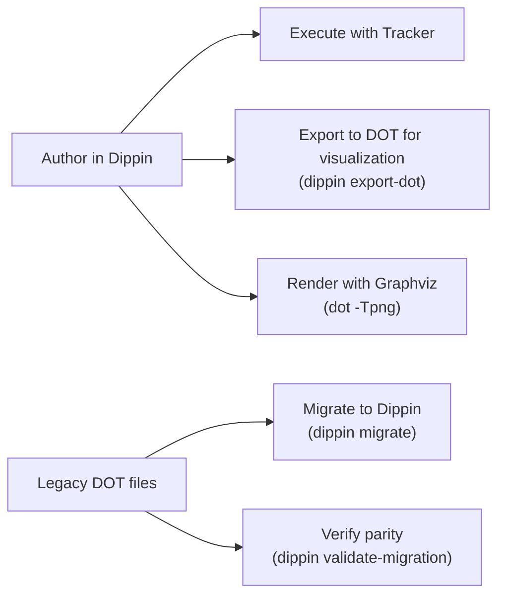
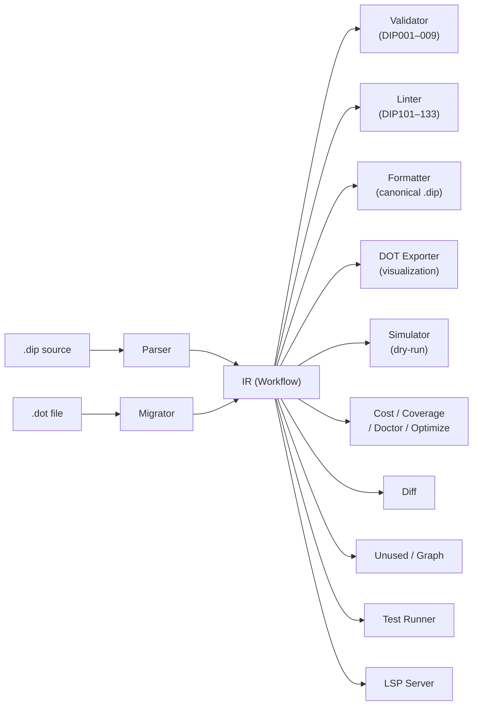

# Dippin

A language and toolchain for authoring AI pipeline workflows.

Dippin is a domain-specific language that replaces [Graphviz DOT](https://graphviz.org/doc/info/lang.html) as the authoring format for [Tracker](https://github.com/2389-research/tracker) pipelines. It gives prompts, shell scripts, model configuration, and branching logic first-class syntax — things that DOT forces into escaped string attributes.

## Why Not Just DOT?

DOT is a great graph language. Dippin doesn't replace DOT for visualization — it replaces DOT for *authoring*. The two coexist:



**What DOT does well** — and Dippin preserves:
- Graph-native syntax where nodes and edges are first-class
- Graphviz rendering for instant visualization
- A familiar, widely-tooled ecosystem

**What DOT does badly** — and Dippin fixes:

| Problem | DOT | Dippin |
|---------|-----|--------|
| Multi-line prompts | `prompt="line1\nline2\nline3"` | Indented block, no escaping |
| Shell scripts | `tool_command="#!/bin/sh\nset -eu\nif..."` | Real multiline, real syntax |
| Model config | Untyped `llm_model="..."` attribute | Typed `model:` field with validation |
| Branching | `condition="context.x!=y && context.a==b"` | `when ctx.x != "y" and ctx.a == "b"` |
| Validation | Silent — typos in attrs are ignored | 42 diagnostic codes (DIP001–DIP009, DIP101–DIP137) |
| Node types | Shape overloading (`box`=agent, `hexagon`=human) | Explicit `agent`, `tool`, `human` keywords |
| Composition | No import/include system | `subgraph` with ref (v2) |

**DOT is still the visualization target.** `dippin export-dot` generates DOT for Graphviz rendering. The migration tool (`dippin migrate`) converts existing DOT pipelines to Dippin with structural parity verification.

## Quick Start

### Prerequisites

[Go 1.21+](https://go.dev/dl/) is required.

### Install

```sh
go install github.com/2389-research/dippin-lang/cmd/dippin@latest
```

Or build from source:

```sh
git clone https://github.com/2389-research/dippin-lang.git
cd dippin-lang
go install ./cmd/dippin/
```

Verify:

```sh
dippin help
```

### Your First Workflow

Create `hello.dip`:

```
workflow Hello
  goal: "Ask the user a question and respond"
  start: Ask
  exit: Respond

  human Ask
    mode: freeform

  agent Respond
    model: claude-sonnet-4-6
    provider: anthropic
    prompt:
      The user said something. Respond helpfully.

  edges
    Ask -> Respond
```

Validate it:

```sh
$ dippin validate hello.dip
validation passed

$ dippin lint hello.dip
# Clean — no warnings

$ dippin export-dot hello.dip | dot -Tpng -o hello.png
# Generates a Graphviz visualization
```

### Migrate an Existing DOT Pipeline

```sh
# Convert DOT to Dippin
dippin migrate --output pipeline.dip pipeline.dot

# Verify structural equivalence
dippin validate-migration pipeline.dot pipeline.dip

# Check the result
dippin lint pipeline.dip
```

## Commands

### Authoring

| Command | Description |
|---------|-------------|
| `dippin parse <file>` | Parse and output IR as JSON |
| `dippin validate <file>` | Structural validation (DIP001–DIP009) |
| `dippin lint <file>` | Validation + semantic warnings (DIP101–DIP133) |
| `dippin check [--format json\|text] <file>` | Parse+validate+lint in one shot (JSON default, for LLM tooling) |
| `dippin fmt [--check] [--write] <file>` | Format to canonical style |
| `dippin new [--name N] [--write F] <template>` | Generate a starter .dip from a template |
| `dippin export-dot [--rankdir LR] [--prompts] <file>` | Export to Graphviz DOT |
| `dippin migrate [--output <file>] <file.dot>` | Convert DOT to Dippin |
| `dippin validate-migration <old.dot> <new.dip>` | Verify migration parity |

### Analysis

| Command | Description |
|---------|-------------|
| `dippin simulate [--scenario k=v] [--all-paths] <file>` | Dry-run the execution graph (JSONL events) |
| `dippin cost <file>` | Estimate execution cost by model/provider |
| `dippin coverage <file>` | Analyze edge coverage and reachability |
| `dippin doctor <file>` | Health report card (grade A–F with suggestions) |
| `dippin optimize <file>` | Model cost optimization suggestions |
| `dippin diff <old.dip> <new.dip>` | Semantic diff between two workflows |
| `dippin feedback <workflow> <telemetry>` | Compare predicted vs actual costs |
| `dippin explain <DIPxxx>` | Explain a diagnostic code in detail |
| `dippin unused <file>` | Detect dead-branch nodes and wasted cost |
| `dippin graph [--compact] <file>` | Render ASCII DAG of the workflow |
| `dippin test [--verbose] [--coverage] <file>` | Run scenario tests from .test.json |

### Editor & Tooling

| Command | Description |
|---------|-------------|
| `dippin watch <file-or-dir> [...]` | Watch .dip files and re-lint on changes |
| `dippin lsp` | Start Language Server Protocol server (stdio) |
| `dippin version` | Show version info |
| `dippin help` | Show usage |

**Exit codes:** 0 = ok, 1 = errors found, 2 = usage error.

**Machine-readable output:** Add `--format json` to any command for JSON diagnostics on stderr.

**CI usage:** `dippin fmt --check` exits 1 if the file isn't canonically formatted. `dippin lint` exits 0 even with warnings (only errors cause exit 1).

See [`docs/cli.md`](docs/cli.md) for full command reference, and [`docs/analysis.md`](docs/analysis.md) for analysis command output formats.

## Language Reference

The full grammar is specified in [`docs/GRAMMAR.ebnf`](docs/GRAMMAR.ebnf). Here's the practical reference.

### Workflow Structure

Every `.dip` file contains one workflow:

```
workflow <Name>
  goal: "What this pipeline does"
  start: <EntryNodeID>
  exit: <ExitNodeID>

  defaults             # Optional graph-level defaults
    model: claude-sonnet-4-6
    provider: anthropic
    max_retries: 3
    fidelity: summary:medium

  # Node declarations (any order)
  agent <ID>
    ...
  tool <ID>
    ...
  human <ID>
    ...

  # Edge declarations
  edges
    A -> B
    B -> C when ctx.outcome == "success"
```

### Node Types

**`agent`** — calls an LLM:

```
  agent Analyze
    label: "Deep Analysis"
    model: claude-opus-4-6
    provider: anthropic
    reasoning_effort: high
    fidelity: full:high
    goal_gate: true         # Pipeline fails if this node fails
    auto_status: true       # Parse STATUS: success/fail from response
    max_turns: 10
    prompt:
      Multi-line prompt. No escaping.
      Write markdown, code, anything.
      Reference context: ${ctx.last_response}
```

**`tool`** — runs a shell command:

```
  tool Build
    label: "Build and Test"
    timeout: 60s
    command:
      #!/bin/sh
      set -eu
      go build ./...
      go test ./... 2>&1
      printf 'done'
```

**`human`** — waits for user input:

```
  human Approve
    label: "Human Approval"
    mode: choice          # or "freeform"
    default: approve
```

**`parallel` / `fan_in`** — concurrent execution:

```
  parallel ReviewFan -> ReviewA, ReviewB, ReviewC
  fan_in ReviewJoin <- ReviewA, ReviewB, ReviewC
```

**`subgraph`** — embedded sub-workflow:

```
  subgraph Nested
    ref: other_workflow.dip
```

**`manager_loop`** — supervises a child sub-pipeline, polling it on a cadence and optionally steering it by injecting context during execution. Maps to Tracker's `stack.manager_loop` and DOT shape `house`.

```
  manager_loop QualityGate
    label: "Quality Gate Supervisor"
    subgraph_ref: quality_loop.dip
    poll_interval: 30s
    max_cycles: 12
    stop_condition: stack.child.outcome = success
    steer_condition: stack.child.cycles = 5
    steer_context:
      hint: halfway_through
      priority: high
```

See [`docs/nodes.md`](docs/nodes.md) for the full field reference and lint codes (DIP135–DIP137).

### Edges and Conditions

```
  edges
    A -> B                                          # Unconditional
    A -> C when ctx.outcome == "fail"               # Conditional
    A -> D when ctx.outcome == "success" and ctx.retries < 3
    A -> B weight: 10                               # Priority weight
    A -> B label: "happy path"                      # Display label
    Retry -> Start restart: true                    # Loop restart
```

**Condition operators:** `=`, `==`, `!=`, `contains`, `not contains`, `startswith`, `endswith`, `in`, `and`, `or`, `not`.

**Context variables** use dotted namespaces: `ctx.outcome`, `ctx.last_response`, `graph.goal`.

### Multiline Blocks

Any field ending with `:` followed by a newline starts a raw text block. The indented content below is preserved verbatim — no tokenization, no escaping:

```
  agent Writer
    prompt:
      # This markdown header is prompt content, not a Dippin comment
      Write code like this:
      ```python
      print("hello -> world")  # arrows and colons are fine
      ```

  tool Runner
    command:
      #!/bin/bash
      set -euo pipefail
      if [ -f go.mod ]; then
        go test ./... 2>&1 || { echo "failed"; exit 1; }
      fi
```

Shell scripts with `if`/`fi`, here-docs, `case`/`esac`, process substitution, and any other construct work without modification.

### Comments

```
  # Full-line comment
  agent Foo  # Inline comment (must be preceded by whitespace)
```

Comments are not stripped inside multiline blocks — a `#` inside a prompt or command is literal content.

### All Node Fields

| Field | Node types | Description |
|-------|-----------|-------------|
| `label` | all | Display name |
| `model` | agent | LLM model (overrides default) |
| `provider` | agent | anthropic, openai, gemini |
| `prompt` | agent | Prompt text (multiline) |
| `system_prompt` | agent | System prompt (multiline) |
| `reasoning_effort` | agent | none, minimal, low, medium, high, xhigh, max |
| `fidelity` | agent | summary:low, summary:medium, summary:high, full:high |
| `goal_gate` | agent | true/false — pipeline fails if this node fails |
| `auto_status` | agent | true/false — parse STATUS: from response |
| `max_turns` | agent | Max LLM conversation turns |
| `command` | tool | Shell command (multiline) |
| `timeout` | tool | Duration (30s, 5m, 1h) |
| `outputs` | tool | Declared stdout values for coverage analysis |
| `mode` | human | freeform or choice |
| `default` | human | Default choice |
| `ref` | subgraph | Workflow path |
| `retry_policy` | all | standard, aggressive, patient, linear, none |
| `max_retries` | all | Max retry count |
| `base_delay` | all | Override policy's base delay (e.g. 500ms, 2s) |
| `retry_target` | all | Node to retry from |
| `fallback_target` | all | Fallback if retries exhausted |
| `reads` | all | Context keys read (advisory, comma-separated) |
| `writes` | all | Context keys written (advisory, comma-separated) |

## Diagnostics

Dippin diagnostics follow the Rust compiler convention: each has a code, severity, source location, explanation, and suggested fix.

```
$ dippin validate broken.dip
error[DIP003]: unknown node reference "InterpretX" in edge
  --> broken.dip:45:5
  = help: did you mean "Interpret"? (declared at line 12)
```

### Errors (DIP001–DIP009)

| Code | What it catches |
|------|----------------|
| DIP001 | Missing or undeclared start node |
| DIP002 | Missing or undeclared exit node |
| DIP003 | Edge references unknown node (suggests typo fixes via edit distance) |
| DIP004 | Unreachable node (not connected from start) |
| DIP005 | Unconditional cycle (restart edges are excluded) |
| DIP006 | Exit node has outgoing edges |
| DIP007 | Parallel/fan_in target mismatch |
| DIP008 | Duplicate node ID |
| DIP009 | Duplicate edge |

### Warnings (DIP101–DIP133)

| Code | What it catches |
|------|----------------|
| DIP101 | Node only reachable via conditional edges (suppressed when source conditions are exhaustive) |
| DIP102 | Conditional edges with no unconditional fallback (suppressed when conditions are exhaustive) |
| DIP103 | Overlapping edge conditions |
| DIP104 | Unbounded retries (no max_retries) |
| DIP105 | No forward path from start to exit (excluding restart edges) |
| DIP106 | Unknown variable namespace in `${...}` |
| DIP107 | Node reads context key no upstream node writes |
| DIP108 | Unknown model or provider name |
| DIP109 | Subgraph namespace collision |
| DIP110 | Agent with empty prompt (start/exit nodes exempt) |
| DIP111 | Tool with no timeout |
| DIP112 | I/O data flow — reads key not written upstream |
| DIP113 | Invalid retry policy name (typo or unrecognized) |
| DIP114 | Invalid fidelity level (typo or unrecognized) |
| DIP115 | Goal gate node without retry or fallback target |
| DIP116 | Invalid compaction_threshold or on_resume value |
| DIP117 | Stylesheet references undefined class |
| DIP118 | Stylesheet references unknown node ID |
| DIP119 | Invalid reasoning_effort value |
| DIP120 | Condition variable missing namespace prefix |
| DIP121 | Condition references variable not in source node writes |
| DIP122 | Condition tests value not in source node outputs |
| DIP123 | Tool command has shell syntax errors (`bash -n`) |
| DIP124 | Tool command references runtime-only `${ctx.*}` variable |
| DIP125 | Tool command binary not found on PATH |
| DIP126 | Subgraph ref file does not exist |
| DIP135 | Manager loop subgraph_ref missing or file does not exist |
| DIP136 | Manager loop control field has invalid value |
| DIP137 | Manager loop with max_cycles: 0 (unbounded) |

## Simulation

Dry-run a workflow to see the execution path without calling LLMs or running commands:

```sh
$ dippin simulate examples/ask_and_execute.dip
{"event":"pipeline_start","workflow":"AskAndExecute",...}
{"event":"node_enter","node":"Start","kind":"agent",...}
{"event":"node_exit","node":"Start","status":"success",...}
{"event":"edge_traverse","from":"Start","to":"SetupWorkspace",...}
...
{"event":"pipeline_end","status":"success","nodes_visited":12,...}
```

Explore failure paths:

```sh
dippin simulate workflow.dip --scenario outcome=fail
```

Enumerate all possible paths through the graph:

```sh
dippin simulate workflow.dip --all-paths
```

## Editor Support

### LSP Server

`dippin lsp` starts a Language Server Protocol server on stdio, providing:
- Real-time diagnostics (parse errors + lint warnings on every keystroke)
- Hover tooltips (node kind, model, provider, prompt preview)
- Go-to-definition (jump from edge node references to node declarations)
- Autocomplete (node IDs in edges, field names, keywords)
- Document symbols (outline of nodes and edges)

Works with any LSP-compatible editor. See [`docs/editor-setup.md`](docs/editor-setup.md) for configuration.

### VS Code Extension

A dedicated extension is available in [`editors/vscode/`](editors/vscode/) providing:
- Syntax highlighting for `.dip` files
- Comment toggling (`Ctrl+/`)
- Indentation-based folding
- Auto-indent after `:`

See the [extension README](editors/vscode/README.md) for installation.

## Examples

The [`examples/`](examples/) directory contains 17 workflows:

**Production patterns** (migrated from Tracker, with original `.dot` files):

| Example | Pattern |
|---------|---------|
| `ask_and_execute` | Multi-model parallel implementation with human approval gate |
| `consensus_task` / `consensus_task_parity` | Three-model consensus with cross-review and parity variant |
| `human_gate_showcase` | Human gate patterns (freeform, choice, approval) |
| `megaplan` / `megaplan_quality` | Multi-phase sprint planning with orientation, drafting, Q&A |
| `semport` / `semport_thematic` | Semantic porting between codebases |
| `sprint_exec` | Sprint execution with parallel implementation and review |
| `vulnerability_analyzer` | Security analysis with static scanning |

**Stress tests** (parser and validator edge cases):

| Example | What it tests |
|---------|--------------|
| `stress_shell_hell` | Here-docs, `case`/`esac`, process substitution, traps, arrays |
| `stress_prompt_chaos` | Markdown, code blocks, Dippin syntax inside prompts, JSON, regex |
| `stress_graph_monster` | 20 nodes, 4 parallel groups, conditional routing, restart edges |
| `stress_edge_cases` | Every field populated, empty prompts, colons in values |
| `stress_adversarial` | Dippin grammar in prompts, Unicode (CJK/Arabic/emoji), nested here-docs |

## Architecture



Everything flows through `ir.Workflow` — the canonical intermediate representation. Packages never reach into each other's internals.

| Package | What it does |
|---------|-------------|
| `ir/` | Core types: `Workflow`, `Node`, `Edge`, `Condition` AST, typed `NodeConfig` sealed interface |
| `parser/` | Indentation-aware lexer + recursive-descent parser producing IR |
| `validator/` | 9 structural checks + 30 semantic lint rules |
| `formatter/` | Canonical pretty-printer (idempotent: `format(format(x)) == format(x)`) |
| `export/` | DOT export with shape mapping, condition serialization, restart edge styling |
| `migrate/` | DOT→IR→Dippin converter with namespace prefixing and structural parity checker |
| `simulate/` | Reference graph executor emitting standardized JSONL events |
| `event/` | Canonical event types for the execution protocol |
| `cost/` | Per-node cost estimation by model/provider with pricing tables |
| `coverage/` | Edge coverage analysis, reachability, and termination checks |
| `doctor/` | Health report card aggregating lint + coverage + cost into a grade |
| `optimize/` | Rule-based model substitution suggestions for cost savings |
| `diff/` | Semantic workflow comparison with field-level change tracking |
| `feedback/` | Predicted vs actual cost calibration from telemetry data |
| `unused/` | Dead-branch detection and wasted cost estimation |
| `graph/` | Terminal ASCII DAG rendering (full box-drawing and compact one-liner) |
| `testrunner/` | Scenario test runner loading `.test.json` suites against the simulator |
| `lsp/` | Language Server Protocol server (hover, go-to-def, completion, diagnostics) |
| `scaffold/` | Template generation for `dippin new` |
| `cmd/dippin/` | CLI wiring |

| `cmd/wasm/` | WebAssembly entry point for the browser playground |

Zero external dependencies for core packages. The LSP server uses `go.lsp.dev` libraries. The `watch` command uses `fsnotify`.

See [`docs/architecture.md`](docs/architecture.md) for the full architecture guide.

## Development

```sh
just setup-hooks   # install pre-commit hook (required)
just check         # full check suite: build, vet, fmt, test, complexity, examples
just complexity    # complexity checks only
just test          # run all tests
just fmt           # format all Go files
```

### Code Quality Gates

The pre-commit hook enforces:

| Check | Threshold | Tool |
|-------|-----------|------|
| Cyclomatic complexity | ≤ 5 per function | `gocyclo` |
| Cognitive complexity | ≤ 7 per function | `gocognit` |
| Formatting | `gofmt` canonical | `gofmt -l` |
| Tests | all pass with `-race` | `go test` |
| Examples | all `.dip` files validate | `dippin validate` |

Test functions (`_test.go`) are excluded from complexity enforcement.

See `QUICK_REFERENCE.md` for refactoring patterns when a function exceeds the threshold.

## Like this?

If Dippin saves you from one missing-backslash debugging session, give us a star — it's how we know what to keep building.

## License

MIT
