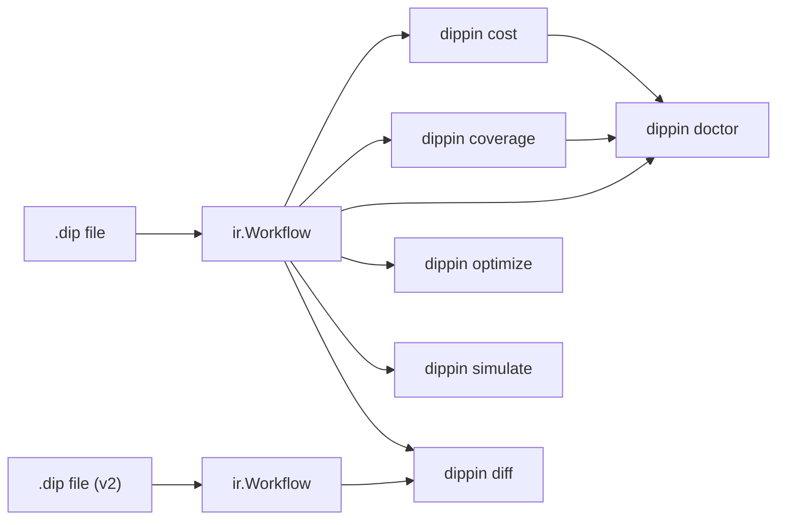

# Analysis Commands

Dippin includes six analysis commands that inspect workflows for cost, coverage, health, optimization opportunities, and change impact. All produce human-readable text output by default.



`doctor` aggregates `cost` + `coverage` + `lint` into a single grade. Run it first for an overview, then drill into specific commands for details.

---

## cost

Estimate execution cost based on model pricing tables.

```sh
dippin cost pipeline.dip
```

**Output:**

```
═══ Cost Estimate ═════════════════════════════════════════
                                Min Expected      Max
  ──────────────────────── ──────── ──────── ────────
  TOTAL                       $3.21    $3.59   $14.10

─── By Provider ───────────────────────────────────────────
  openai                      $0.38    $0.57    $2.96
  anthropic                   $2.83    $3.02   $11.13

─── Top Cost Drivers ──────────────────────────────────────
  CommitWork                  $2.12 (max)  openai/gpt-5.2
  ImplementClaude             $2.12 (max)  anthropic/claude-sonnet-4-6
  InterpretRequest            $1.44 (max)  anthropic/claude-opus-4-6

─── Assumptions ───────────────────────────────────────────
  • unknown model "gemini-3-flash" (provider "gemini"): cost set to $0
```

**How costs are estimated:**
- Prompt length is used to estimate input tokens
- Output tokens are estimated heuristically per turn
- `max_turns` determines the turn range (min=1, expected=max_turns/2, max=max_turns)
- Tool and human nodes cost $0 (no LLM calls)
- Unknown models are costed at $0 with an assumption note

**When to use:** Before deploying a pipeline with expensive models. Compare providers. Identify cost drivers to optimize.

**JSON schema** (via `--format json`):

```json
{
  "nodes": {
    "NodeID": {
      "node_id": "NodeID",
      "model": "claude-opus-4-6",
      "provider": "anthropic",
      "kind": "agent",
      "cost": {"min": 0.10, "expected": 0.41, "max": 1.44},
      "turns": {"min": 1, "expected": 5, "max": 10},
      "tokens": {"prompt_tokens": 150, "input_per_turn": 500, "output_per_turn": 1000}
    }
  },
  "total": {"min": 3.21, "expected": 3.59, "max": 14.10},
  "by_provider": {"anthropic": {"min": 2.83, "expected": 3.02, "max": 11.13}},
  "top_costs": [],
  "assumptions": ["unknown model ..."]
}
```

---

## coverage

Analyze edge coverage and reachability.

```sh
dippin coverage pipeline.dip
```

**Output:**

```
═══ Coverage Analysis ═════════════════════════════════════
─── Edge Coverage ─────────────────────────────────────────
  ✓ SetupWorkspace               no_conditions
  ✗ ValidateBuild                partial
      missing: validation-pass-go
      missing: validation-pass-swift

─── Reachability ──────────────────────────────────────────
  ✓ 30/30 nodes reachable

─── Termination ───────────────────────────────────────────
  ✓ all paths reach exit: true
```

**What it checks:**
- **Edge coverage** — For tool nodes, extracts possible outputs from `printf`/`echo` patterns in the command, then checks whether outgoing edge conditions cover those outputs. Status: `covered`, `partial`, `no_conditions`, `unknown`.
- **Reachability** — BFS from start node to confirm all nodes are reachable.
- **Termination** — Reverse BFS from exit to confirm all reachable nodes can reach exit.

**When to use:** After writing conditional routing to verify all tool outputs have matching edges. The `missing` entries tell you exactly which edges to add.

**JSON schema:**

```json
{
  "nodes": {
    "ValidateBuild": {
      "node_id": "ValidateBuild",
      "status": "partial",
      "declared_outputs": [],
      "extracted_outputs": ["pass-go", "pass-swift"],
      "edge_conditions": ["ctx.outcome = success"],
      "missing_edges": ["validation-pass-go", "validation-pass-swift"],
      "has_fallback": false
    }
  },
  "reachability": {
    "total_nodes": 30,
    "reachable_nodes": 30,
    "unreachable_nodes": []
  },
  "termination": {
    "all_paths_terminate": true,
    "sink_nodes": []
  }
}
```

---

## doctor

Health report card — a single grade (A–F) aggregating lint, coverage, and cost.

```sh
dippin doctor pipeline.dip
```

**Output:**

```
═══ Health Report Card ════════════════════════════════════
  Grade: A  Score: 95/100

─── Lint ──────────────────────────────────────────────────
  Errors: 0  Warnings: 1  Hints: 0

─── Coverage ──────────────────────────────────────────────
  Reachable: 21/21 nodes
  ✓ All paths terminate
  ✓ All tool outputs covered

─── Cost ──────────────────────────────────────────────────
  Expected: $2.10  (range: $1.50 – $8.40)

─── Suggestions ───────────────────────────────────────────
  [lint] review lint warnings — run `dippin lint` for details
```

**Scoring:**
- Starts at 100
- Each lint error: -15 points
- Each lint warning: -5 points
- Unreachable nodes: -10 per node
- Non-terminating paths: -20
- Uncovered tool outputs: -5 per tool

**Grades:** A (90–100), B (80–89), C (70–79), D (60–69), F (<60)

**When to use:** Quick health check before deploying or reviewing a pipeline. The suggestions tell you exactly what to fix and which command to run for details.

**JSON schema:**

```json
{
  "grade": "A",
  "score": 95,
  "lint": {"errors": 0, "warnings": 1, "hints": 0},
  "coverage": {
    "reachable_nodes": 21, "total_nodes": 21,
    "unreachable_count": 0, "all_terminate": true, "uncovered_tools": 0
  },
  "cost": {"total": {"min": 1.50, "expected": 2.10, "max": 8.40}},
  "suggestions": [
    {"category": "lint", "message": "review lint warnings — run `dippin lint` for details"}
  ]
}
```

---

## optimize

Suggest cheaper model substitutions without sacrificing quality.

```sh
dippin optimize pipeline.dip
```

**Output:**

```
═══ Optimization Report ═══════════════════════════════════
─── Cost Summary ──────────────────────────────────────────
  Current:   $3.59 (expected)
  Optimized: $0.00 (expected)
  Savings:   $3.59 (expected)

─── Suggestions ───────────────────────────────────────────
  [InterpretRequest] simple prompt does not need an expensive model
    claude-opus-4-6 → claude-haiku-4-5  (saves ~$0.41)
  [CommitWork] bookkeeping task (summary/cleanup/commit) can use a cheaper model
    gpt-5.2 → gpt-4o-mini  (saves ~$0.30)
```

**Rules applied:**
- Simple prompts (short, no complex instructions) → cheaper model
- Nodes in retry loops → cheaper model for mechanical iterations
- Bookkeeping tasks (summary, cleanup, commit in prompt) → cheaper model

**When to use:** After `dippin cost` shows high costs. Review each suggestion — some "simple" prompts may actually need a capable model.

**JSON schema:**

```json
{
  "suggestions": [
    {
      "node_id": "InterpretRequest",
      "rule": "simple_prompt",
      "message": "simple prompt does not need an expensive model",
      "current_model": "claude-opus-4-6",
      "suggest_model": "claude-haiku-4-5",
      "savings": {"min": 0.10, "expected": 0.41, "max": 1.44}
    }
  ],
  "current_cost": {"min": 3.21, "expected": 3.59, "max": 14.10},
  "optimized_cost": {"min": 0.0, "expected": 0.0, "max": 0.0},
  "savings": {"min": 3.21, "expected": 3.59, "max": 14.10}
}
```

---

## diff

Semantic comparison between two workflow versions.

```sh
dippin diff v1.dip v2.dip
```

**Output:**

```
═══ Semantic Diff ═════════════════════════════════════════
─── Nodes ─────────────────────────────────────────────────
  + FinalQualityGate

─── Edges ─────────────────────────────────────────────────
  + FinalQualityGate -> Exit [ctx.outcome = fail]
  + FinalQualityGate -> PersistSprint [ctx.outcome = success]
  - WriteFinalSprint -> PersistSprint

─── Cost Delta ────────────────────────────────────────────
  Old: $5.35 (expected)  New: $5.78 (expected)
  Delta: +$0.43 (expected)
```

Unlike text-based `diff`, this compares graph structure: nodes added/removed, edges changed, field-level modifications, and cost impact.

**When to use:** Code review for workflow changes. See exactly what graph structure changed and how it affects cost, rather than parsing indentation diffs.

**JSON schema:**

```json
{
  "nodes_added": ["FinalQualityGate"],
  "nodes_removed": [],
  "nodes_modified": [
    {
      "node_id": "Analyze",
      "changes": [
        {"field": "model", "old_value": "claude-sonnet-4-6", "new_value": "claude-opus-4-6"}
      ]
    }
  ],
  "edges_added": [{"from": "FinalQualityGate", "to": "Exit", "condition": "ctx.outcome = fail"}],
  "edges_removed": [{"from": "WriteFinalSprint", "to": "PersistSprint"}],
  "cost_delta": {
    "old_cost": {"min": 4.0, "expected": 5.35, "max": 20.0},
    "new_cost": {"min": 4.2, "expected": 5.78, "max": 22.0},
    "delta": {"min": 0.2, "expected": 0.43, "max": 2.0}
  }
}
```

---

## feedback

Compare predicted costs against actual execution telemetry to calibrate estimates.

```sh
dippin feedback pipeline.dip telemetry.csv
```

**Input:** The workflow file (for predicted costs) and a CSV telemetry file with columns: `node_id`, `input_tokens`, `output_tokens`, `cost_usd`.

**When to use:** After running a pipeline in production, export telemetry and feed it back to see how accurate the cost predictions were. Outliers (>2x or <0.5x ratio) are flagged for investigation.

**JSON schema:**

```json
{
  "nodes": [
    {
      "node_id": "Analyze",
      "predicted_cost": 0.41,
      "actual_cost": 0.38,
      "ratio": 1.08
    }
  ],
  "accuracy_pct": 92.5,
  "outliers": [
    {
      "node_id": "CommitWork",
      "ratio": 3.2,
      "message": "actual cost 3.2x higher than predicted"
    }
  ]
}
```

---

## Composing Analysis Commands

A typical analysis workflow:

```sh
# 1. Quick health check
dippin doctor pipeline.dip

# 2. If grade < B, drill into specifics
dippin lint pipeline.dip          # fix warnings
dippin coverage pipeline.dip      # add missing edges
dippin cost pipeline.dip          # check cost drivers

# 3. Optimize expensive nodes
dippin optimize pipeline.dip

# 4. After changes, verify impact
dippin diff old.dip new.dip

# 5. After production runs, calibrate
dippin feedback pipeline.dip telemetry.csv
```
