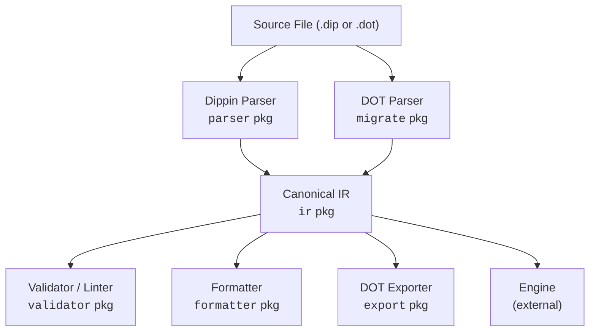
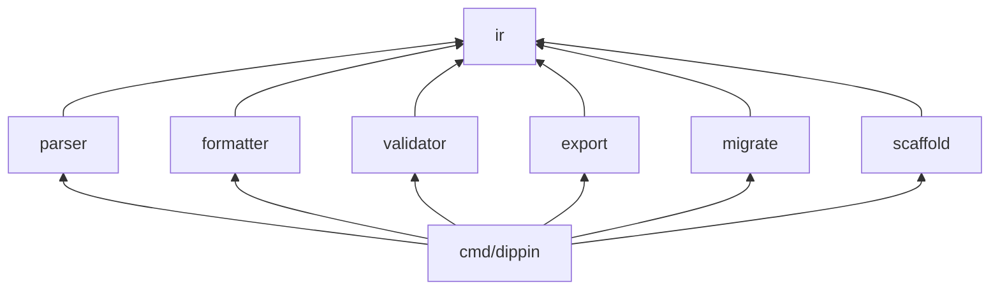

# Architecture Guide

This document describes how the Dippin toolchain is organized internally — the packages, data flow, and design decisions that shape the codebase.

---

## Overview

Dippin is a multi-stage compiler pipeline:



All downstream consumers program against the **canonical IR** — a set of Go structs defined in the `ir` package. This decouples parsing from everything else.

---

## Package Map

```
dippin-lang/
├── ir/                 # Canonical intermediate representation (types only)
│   ├── ir.go           # Workflow, Node, NodeConfig, RetryConfig, NodeIO
│   ├── edge.go         # Edge, Condition, ConditionExpr
│   ├── source.go       # SourceLocation, SourceMap
│   └── lookup.go       # Helper methods (Node, EdgesFrom, EdgesTo, NodeIDs)
│
├── parser/             # Lexer + recursive descent parser
│   ├── lexer.go        # Indentation-aware tokenizer
│   └── parser.go       # Produces ir.Workflow from tokens
│
├── validator/          # Graph validation + semantic linting
│   ├── codes.go        # Error code constants (DIP001–DIP009)
│   ├── lint_codes.go   # Warning code constants (DIP101–DIP112)
│   ├── diagnostic.go   # Diagnostic type, Result, Severity
│   ├── validate.go     # 9 structural checks
│   └── lint.go         # 12 semantic checks
│
├── formatter/          # Canonical .dip source formatter
│   └── format.go       # IR → canonical .dip text (idempotent)
│
├── export/             # DOT graph exporter
│   └── dot.go          # IR → Graphviz DOT format
│
├── migrate/            # DOT ↔ Dippin migration
│   ├── migrate.go      # DOT string → ir.Workflow
│   ├── dot_parser.go   # Custom DOT parser
│   └── parity.go       # Structural comparison for migration verification
│
├── scaffold/           # Template scaffolding for `dippin new`
│   └── scaffold.go     # Build(template, name) → *ir.Workflow
│
└── cmd/dippin/         # CLI entry point
    ├── main.go         # os.Args → Run()
    └── cli.go          # All commands, flag parsing, output formatting
```

### Dependency Graph



The `ir` package is a leaf dependency — it imports only `time` from the standard library. Every other package imports `ir` but not each other (with the exception of `cmd/dippin` which imports all).

---

## The IR Package

The `ir` package is the heart of the system. It defines the data model that every other package operates on.

### Design Principles

**Explicit over implicit**: No shape-to-handler mapping. `Node.Kind` directly states what the node is. `Workflow.Start` and `Workflow.Exit` are named fields, not inferred from declaration order.

**Type-safe**: Each node kind has its own config struct (`AgentConfig`, `HumanConfig`, `ToolConfig`, etc.) implementing the sealed `NodeConfig` interface. Invalid field combinations are structurally impossible — you can't set a `Prompt` on a `ToolConfig`.

**Normalized**: Conditions are parsed ASTs (`ConditionExpr`), not raw strings. Variables are namespace-qualified (`ctx.outcome`, not `outcome`).

**Syntax-independent**: The IR contains no Dippin syntax details and no DOT shapes. It's a pure semantic representation.

**Diagnosable**: Every `Node` and `Edge` carries a `SourceLocation` for accurate error reporting.

### Sealed Interfaces

Both `NodeConfig` and `ConditionExpr` use Go's sealed interface pattern:

```go
type NodeConfig interface { nodeConfig() }   // unexported method
type AgentConfig struct { ... }
func (AgentConfig) nodeConfig() {}            // only types in this package can implement
```

Because the `nodeConfig()` method is unexported, only types within the `ir` package can implement `NodeConfig`. This prevents external code from creating invalid node configurations and makes exhaustive `switch` statements safe.

### Lookup Helpers

The `lookup.go` file provides convenience methods on `*Workflow`:

- `Node(id string) *Node` — Find a node by ID
- `EdgesFrom(id string) []*Edge` — All outgoing edges from a node
- `EdgesTo(id string) []*Edge` — All incoming edges to a node
- `NodeIDs() []string` — All node IDs in declaration order

---

## The Parser Package

The parser transforms `.dip` source text into an `ir.Workflow`. It operates in two stages.

### Stage 1: Lexer

The lexer (`lexer.go`) converts source text into a flat token stream. Key features:

- **Indentation tracking**: Maintains an indent stack. When indentation increases, emits `TokenIndent`. When it decreases, emits `TokenOutdent` (potentially multiple if skipping levels).
- **Token types**: `Keyword`, `Identifier`, `Operator`, `Literal`, `Colon`, `Comma`, `Arrow` (`->`), `BackArrow` (`<-`), `LParen`, `RParen`, `Newline`, `EOF`.
- **String handling**: Double-quoted strings with `\"` and `\\` escapes.
- **Comments**: `#` to end-of-line, stripped during lexing.

### Stage 2: Parser

The parser (`parser.go`) is a **recursive descent parser** that consumes the token stream and builds the IR:

1. Parse workflow declaration and header fields
2. Parse optional defaults block
3. Parse node definitions (dispatching by kind keyword)
4. Parse optional edges section
5. Construct and return `ir.Workflow`

**Error recovery**: The parser accumulates errors rather than failing on the first problem, enabling multiple diagnostics per parse.

**Multiline handling**: For `prompt:` and `command:` fields, the parser collects all indented lines until outdent and joins them as the multiline content.

---

## The Validator Package

Validation is split into two passes, both producing `Diagnostic` values:

### Structural Validation (`validate.go`)

Checks graph integrity — things that must be true for any valid workflow:

- Start/exit existence (DIP001, DIP002)
- Edge endpoint validity (DIP003) with Levenshtein suggestions
- Reachability via BFS (DIP004)
- Cycle detection via DFS with white/gray/black coloring (DIP005)
- Exit node constraints (DIP006)
- Parallel/fan-in pairing (DIP007)
- Uniqueness checks (DIP008, DIP009)

**No short-circuiting**: All checks run unconditionally. A single `validate` call reports every issue, not just the first.

### Semantic Linting (`lint.go`)

Checks semantic quality — patterns that are likely bugs:

- Conditional reachability analysis (DIP101, DIP102, DIP103)
- Retry loop analysis (DIP104)
- Path analysis (DIP105)
- Variable usage tracking (DIP106, DIP107, DIP112)
- Provider/model recognition (DIP108)
- Import analysis (DIP109)
- Content checks (DIP110, DIP111)

### The Diagnostic Type

```go
type Diagnostic struct {
    Code     string          // "DIP003"
    Severity Severity        // Error, Warning, Info, Hint
    Message  string          // Human explanation
    Location SourceLocation  // File/line/column
    Help     string          // "did you mean X?"
    Fix      string          // Replacement text
}
```

The `Result` type wraps a slice of diagnostics with convenience methods like `HasErrors()`.

---

## The Formatter Package

The formatter (`format.go`) converts an `ir.Workflow` back to canonical `.dip` source text.

**Key properties**:

- **Idempotent**: `Format(Parse(Format(Parse(source)))) == Format(Parse(source))`
- **Deterministic**: Same IR always produces identical output
- **2-space indentation**: Always
- **Section ordering**: Header → defaults → nodes (grouped by kind) → edges
- **Condition formatting**: Preserves logical structure with minimal parentheses

The formatter is the authority on "canonical form." The `fmt --check` command compares the formatter's output against the source file to detect drift.

---

## The Export Package

The DOT exporter (`dot.go`) converts an `ir.Workflow` to Graphviz DOT syntax.

**Shape mapping**: Each node kind maps to a specific DOT shape (agent→box, human→hexagon, etc.). Start and exit nodes override to Mdiamond and Msquare respectively.

**Options**:
- `IncludePrompts`: When true, includes full prompt/command text as DOT attributes
- `RankDir`: Graph layout direction (TB or LR)

**Styling**:
- Goal gate nodes: red filled background
- Restart edges: dashed line style
- Deterministic attribute ordering for reproducible output

---

## The Migrate Package

The migration package enables bidirectional conversion between DOT and Dippin.

### DOT Parser (`dot_parser.go`)

A custom DOT parser (not using external libraries) that extracts:
- Graph name and attributes
- Node definitions with shapes and attributes
- Edge definitions with conditions and labels

### Migration Logic (`migrate.go`)

Transforms DOT structures into IR:
- Shape → NodeKind mapping
- Attribute extraction into typed config structs
- Prompt/command unescaping from DOT string encoding
- Condition variable namespace prefixing (`outcome` → `ctx.outcome`)
- Start/exit identification from Mdiamond/Msquare shapes
- Graph attributes → WorkflowDefaults

### Parity Checker (`parity.go`)

`CheckParity` compares two `ir.Workflow` instances and reports structural differences:
- Missing/extra nodes
- Different node kinds or configurations
- Missing/extra edges
- Different conditions or labels

Used by `validate-migration` to verify that a migrated `.dip` file faithfully represents the original DOT.

---

## The CLI Package

The CLI (`cmd/dippin/cli.go`) is a thin orchestration layer:

1. Parse global flags (`--format`)
2. Dispatch to the appropriate command handler
3. Each handler: parse flags → load workflow → call package function → render output
4. Return exit code

**Testability**: The `Run` function accepts `args []string` and `io.Writer` parameters, making it fully testable without touching `os.Args` or `os.Stdout`. The test file (`main_test.go`) exercises all commands via this interface.

**Auto-detection**: `loadWorkflow` checks file extension — `.dot` routes to `migrate.Migrate`, `.dip` routes to `parser.NewParser`.
