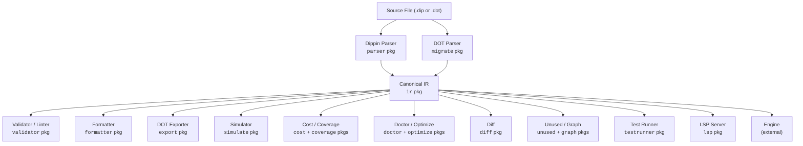
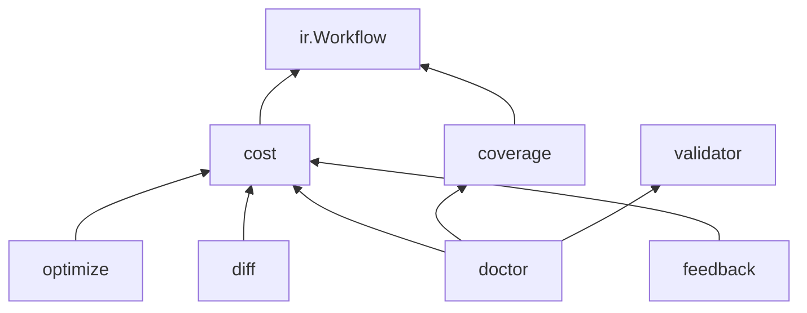

# Architecture Guide

This document describes how the Dippin toolchain is organized internally — the packages, data flow, and design decisions that shape the codebase.

---

## Overview

Dippin is a multi-stage compiler pipeline:



All downstream consumers program against the **canonical IR** — a set of Go structs defined in the `ir` package. This decouples parsing from everything else.

---

## Package Map

```
dippin-lang/
├── ir/                 # Canonical intermediate representation (types only)
│   ├── ir.go           # Workflow, Node, NodeConfig, RetryConfig, NodeIO
│   ├── edge.go         # Edge, Condition, ConditionExpr
│   ├── source.go       # SourceLocation, SourceMap
│   └── lookup.go       # Helper methods (Node, EdgesFrom, EdgesTo, AllEdges, NodeIDs)
│
├── parser/             # Lexer + recursive descent parser
│   ├── lexer.go        # Indentation-aware tokenizer
│   ├── parser.go       # Produces ir.Workflow from tokens
│   ├── parse_defaults.go  # Defaults block parsing
│   ├── parse_edges.go     # Edge and condition parsing
│   ├── parse_nodes.go     # Node declaration parsing
│   ├── parse_stylesheet.go # Stylesheet section parsing
│   └── parse_helpers.go   # Shared utilities
│
├── validator/          # Graph validation + semantic linting
│   ├── codes.go        # Error code constants (DIP001–DIP009)
│   ├── lint_codes.go   # Warning code constants (DIP101–DIP126)
│   ├── diagnostic.go   # Diagnostic type, Result, Severity
│   ├── validate.go     # 9 structural checks
│   ├── lint.go         # Lint orchestration
│   ├── lint_reachability.go  # DIP101, DIP102, DIP105, exhaustive detection
│   ├── lint_conditions.go    # DIP103, DIP120
│   ├── lint_context.go       # DIP106, DIP107, DIP112
│   ├── lint_retry.go         # DIP104, DIP115
│   ├── lint_model.go         # DIP108, DIP119
│   └── lint_style.go         # DIP109, DIP110, DIP111, DIP113, DIP114, DIP116–DIP118
│
├── formatter/          # Canonical .dip source formatter
│   └── format.go       # IR → canonical .dip text (idempotent)
│
├── export/             # DOT graph exporter
│   └── dot.go          # IR → Graphviz DOT format
│
├── migrate/            # DOT ↔ Dippin migration
│   ├── migrate.go      # DOT string → ir.Workflow
│   ├── dot_parser.go   # Custom DOT parser
│   └── parity.go       # Structural comparison for migration verification
│
├── simulate/           # Reference graph executor
│   ├── simulate.go     # JSONL event-emitting simulator
│   ├── condition.go    # Condition evaluator (parses and evaluates AST)
│   ├── defaults.go     # Default value propagation and per-node scenarios
│   ├── path_enumerator.go  # All-paths enumeration for --all-paths
│   ├── interactive.go  # Human node interaction simulation
│   └── events.go       # JSONL event emission
│
├── event/              # Execution protocol event types
│   └── event.go        # pipeline_start, node_enter, node_exit, edge_traverse, pipeline_end
│
├── cost/               # Cost estimation engine
│   ├── cost.go         # Per-node cost analysis with turn/token heuristics
│   └── pricing.go      # Model pricing tables by provider
│
├── coverage/           # Edge coverage analysis
│   └── coverage.go     # Tool output extraction, reachability, termination
│
├── doctor/             # Health report card
│   └── doctor.go       # Aggregates validator + coverage + cost into grade A–F
│
├── optimize/           # Model optimization suggestions
│   ├── optimize.go     # Report generation
│   ├── rules.go        # Optimization rules engine
│   └── prompt.go       # Prompt complexity analysis
│
├── diff/               # Semantic workflow comparison
│   └── diff.go         # Node/edge/cost delta between two workflows
│
├── feedback/           # Cost calibration from telemetry
│   ├── feedback.go     # Predicted vs actual cost comparison
│   └── telemetry.go    # JSONL telemetry reader
│
├── unused/             # Dead-branch detection
│   └── unused.go       # Sink-node analysis + wasted cost estimation
│
├── graph/              # ASCII DAG rendering
│   ├── graph.go        # Topological layering (Kahn's algorithm)
│   └── render.go       # Box-drawing + compact one-liner output
│
├── testrunner/         # Scenario test runner
│   ├── types.go        # TestSuite, TestCase, Expectation structs
│   ├── load.go         # .test.json file loader
│   └── runner.go       # Run cases through simulator, check assertions
│
├── lsp/                # Language Server Protocol server
│   ├── server.go       # JSONRPC2 handler dispatch
│   ├── diagnostics.go  # Real-time diagnostic publication
│   ├── document.go     # In-memory document store
│   ├── hover.go        # Hover tooltip generation
│   ├── definition.go   # Go-to-definition
│   ├── completion.go   # Autocomplete suggestions
│   └── symbols.go      # Document symbol outline
│
├── dipx/               # .dipx bundle format (loader tier)
│   ├── dipx.go         # Open, OpenLax, OpenReader, Pack, Extract, Validate
│   ├── source.go       # Source interface, dirSource, Load (.dip vs .dipx)
│   ├── manifest.go     # Manifest decode/encode + shape verification
│   ├── bundle.go       # Bundle (Workflow, Identity, Manifest, ReadFile)
│   ├── zipio.go        # Constrained zip reader (rejects forbidden features)
│   ├── resolve.go      # Path canonicalization, Windows reserved names
│   ├── helpers.go      # Hash verify, parse-and-link, walkSourceTree
│   └── errors.go       # BundleError sentinels
│
├── scaffold/           # Template scaffolding for `dippin new`
│   └── scaffold.go     # Build(template, name) → *ir.Workflow
│
└── cmd/dippin/         # CLI entry point
    ├── main.go         # os.Args → Run()
    ├── cli.go          # Command dispatch and global flag handling
    ├── cmd_parse.go    # parse command
    ├── cmd_validate.go # validate command
    ├── cmd_check.go    # check command
    ├── cmd_fmt.go      # fmt command
    ├── cmd_new.go      # new command
    ├── cmd_export.go   # export-dot command
    ├── cmd_migrate.go  # migrate + validate-migration commands
    ├── cmd_simulate.go # simulate command
    ├── cmd_cost.go     # cost command
    ├── cmd_coverage.go # coverage command
    ├── cmd_doctor.go   # doctor command
    ├── cmd_optimize.go # optimize command
    ├── cmd_diff.go     # diff command
    ├── cmd_feedback.go # feedback command
    ├── cmd_explain.go  # explain command
    ├── cmd_unused.go   # unused command
    ├── cmd_graph.go    # graph command
    ├── cmd_test_runner.go # test command
    ├── cmd_lsp.go      # lsp command
    ├── cmd_pack.go     # pack command (.dipx producer)
    ├── cmd_unpack.go   # unpack command (.dipx → directory)
    └── cmd_inspect.go  # inspect command (.dipx → manifest summary)
```

### Loader Tier (dipx)

The `dipx` package is a bounded exception to the "packages only depend on `ir`" rule: it imports `ir + parser + simulate` to materialize a parsed, condition-normalized workflow tree from a `.dipx` bundle (or from a `.dip` on disk via `dirSource`). It MUST NOT import `validator`, `cost`, `formatter`, or any analysis package — that would invert the analysis dependency direction. Pack-time structural validation (DIP001–DIP009) is therefore invoked at the CLI layer in `cmd/dippin/cmd_pack.go` (`validateEntryPrePack`), not inside `dipx` itself.

The package's central type-encoded ordering invariant is `verifiedBytes`: an unexported wrapper produced exclusively by the hash-verification step. The Open pathway's `parser.NewParser(string(verifiedBytes.Bytes()), …)` site cannot be reached without going through hash verification first, making "parse before verify" structurally impossible. Two additional `parser.NewParser` sites exist for the dirSource and Pack pathways (which consume trusted local-disk bytes, not bundle bytes); a CI test (`TestInvariant_ParserNewParserSiteCount`) pins the total to exactly three.

### Dependency Graph

```mermaid
graph BT
    ir["ir"]
    parser["parser"] --> ir
    formatter["formatter"] --> ir
    validator["validator"] --> ir
    export["export"] --> ir
    migrate["migrate"] --> ir
    scaffold["scaffold"] --> ir
    simulate["simulate"] --> ir
    event["event"]
    cost["cost"] --> ir
    coverage["coverage"] --> ir
    coverage --> simulate
    doctor["doctor"] --> ir
    doctor --> validator
    doctor --> coverage
    doctor --> cost
    optimize["optimize"] --> ir
    optimize --> cost
    diff["diff"] --> ir
    diff --> cost
    feedback["feedback"] --> cost
    unused["unused"] --> ir
    unused --> coverage
    unused --> cost
    graph["graph"] --> ir
    testrunner["testrunner"] --> ir
    testrunner --> simulate
    lsp["lsp"] --> ir
    lsp --> parser
    lsp --> validator
    cmd["cmd/dippin"] --> parser
    cmd --> formatter
    cmd --> validator
    cmd --> export
    cmd --> migrate
    cmd --> scaffold
    cmd --> simulate
    cmd --> cost
    cmd --> coverage
    cmd --> doctor
    cmd --> optimize
    cmd --> diff
    cmd --> feedback
    cmd --> lsp
    cmd --> unused
    cmd --> graph
    cmd --> testrunner
```

The `ir` package is a leaf dependency — it imports only `time` from the standard library. Most packages import only `ir`. The analysis packages (`doctor`, `optimize`, `diff`, `feedback`) compose other analysis packages. The LSP server imports `parser` and `validator` for real-time analysis.

Zero external dependencies for core packages. The `lsp` package uses `go.lsp.dev` libraries for the JSON-RPC 2.0 protocol.

---

## The IR Package

The `ir` package is the heart of the system. It defines the data model that every other package operates on.

### Design Principles

**Explicit over implicit**: No shape-to-handler mapping. `Node.Kind` directly states what the node is. `Workflow.Start` and `Workflow.Exit` are named fields, not inferred from declaration order.

**Type-safe**: Each node kind has its own config struct (`AgentConfig`, `HumanConfig`, `ToolConfig`, etc.) implementing the sealed `NodeConfig` interface. Invalid field combinations are structurally impossible — you can't set a `Prompt` on a `ToolConfig`.

**Normalized**: Conditions are parsed ASTs (`ConditionExpr`), not raw strings. Variables are namespace-qualified (`ctx.outcome`, not `outcome`).

**Syntax-independent**: The IR contains no Dippin syntax details and no DOT shapes. It's a pure semantic representation.

**Diagnosable**: Every `Node` and `Edge` carries a `SourceLocation` for accurate error reporting.

### Sealed Interfaces

Both `NodeConfig` and `ConditionExpr` use Go's sealed interface pattern:

```go
type NodeConfig interface { nodeConfig() }   // unexported method
type AgentConfig struct { ... }
func (AgentConfig) nodeConfig() {}            // only types in this package can implement
```

Because the `nodeConfig()` method is unexported, only types within the `ir` package can implement `NodeConfig`. This prevents external code from creating invalid node configurations and makes exhaustive `switch` statements safe.

### Lookup Helpers

The `lookup.go` file provides convenience methods on `*Workflow`:

- `Node(id string) *Node` — Find a node by ID
- `EdgesFrom(id string) []*Edge` — All outgoing edges from a node
- `EdgesTo(id string) []*Edge` — All incoming edges to a node
- `NodeIDs() []string` — All node IDs in declaration order

---

## The Parser Package

The parser transforms `.dip` source text into an `ir.Workflow`. It operates in two stages.

### Stage 1: Lexer

The lexer (`lexer.go`) converts source text into a flat token stream. Key features:

- **Indentation tracking**: Maintains an indent stack. When indentation increases, emits `TokenIndent`. When it decreases, emits `TokenOutdent` (potentially multiple if skipping levels).
- **Token types**: `Keyword`, `Identifier`, `Operator`, `Literal`, `Colon`, `Comma`, `Arrow` (`->`), `BackArrow` (`<-`), `LParen`, `RParen`, `Newline`, `EOF`.
- **String handling**: Double-quoted strings with `\"` and `\\` escapes.
- **Comments**: `#` to end-of-line, stripped during lexing.

### Stage 2: Parser

The parser (`parser.go`) is a **recursive descent parser** that consumes the token stream and builds the IR:

1. Parse workflow declaration and header fields
2. Parse optional defaults block
3. Parse node definitions (dispatching by kind keyword)
4. Parse optional edges section
5. Construct and return `ir.Workflow`

**Error recovery**: The parser accumulates errors rather than failing on the first problem, enabling multiple diagnostics per parse.

**Multiline handling**: For `prompt:` and `command:` fields, the parser collects all indented lines until outdent and joins them as the multiline content.

---

## The Validator Package

Validation is split into two passes, both producing `Diagnostic` values:

### Structural Validation (`validate.go`)

Checks graph integrity — things that must be true for any valid workflow:

- Start/exit existence (DIP001, DIP002)
- Edge endpoint validity (DIP003) with Levenshtein suggestions
- Reachability via BFS (DIP004)
- Cycle detection via DFS with white/gray/black coloring (DIP005)
- Exit node constraints (DIP006)
- Parallel/fan-in pairing (DIP007)
- Uniqueness checks (DIP008, DIP009)

**No short-circuiting**: All checks run unconditionally. A single `validate` call reports every issue, not just the first.

### Semantic Linting (`lint.go`)

Checks semantic quality — patterns that are likely bugs. Decomposed into focused modules:

- **Reachability** (`lint_reachability.go`): DIP101, DIP102, DIP105 — exhaustive condition detection shared between DIP101 and DIP102
- **Conditions** (`lint_conditions.go`): DIP103, DIP120 — overlapping conditions and namespace enforcement
- **Context flow** (`lint_context.go`): DIP106, DIP107, DIP112 — variable usage tracking
- **Retry** (`lint_retry.go`): DIP104, DIP115 — unbounded retries and goal gate recovery
- **Model** (`lint_model.go`): DIP108, DIP119 — provider/model recognition and reasoning effort
- **Style** (`lint_style.go`): DIP109–DIP111, DIP113–DIP114, DIP116–DIP118 — content checks, policy/fidelity validation, stylesheet refs

### The Diagnostic Type

```go
type Diagnostic struct {
    Code     string          // "DIP003"
    Severity Severity        // Error, Warning, Info, Hint
    Message  string          // Human explanation
    Location SourceLocation  // File/line/column
    Help     string          // "did you mean X?"
    Fix      string          // Replacement text
}
```

The `Result` type wraps a slice of diagnostics with convenience methods like `HasErrors()`.

---

## The Formatter Package

The formatter (`format.go`) converts an `ir.Workflow` back to canonical `.dip` source text.

**Key properties**:

- **Idempotent**: `Format(Parse(Format(Parse(source)))) == Format(Parse(source))`
- **Deterministic**: Same IR always produces identical output
- **2-space indentation**: Always
- **Section ordering**: Header → defaults → nodes (grouped by kind) → edges
- **Condition formatting**: Preserves logical structure with minimal parentheses

The formatter is the authority on "canonical form." The `fmt --check` command compares the formatter's output against the source file to detect drift.

---

## The Export Package

The DOT exporter (`dot.go`) converts an `ir.Workflow` to Graphviz DOT syntax.

**Shape mapping**: Each node kind maps to a specific DOT shape (agent→box, human→hexagon, etc.). Start and exit nodes override to Mdiamond and Msquare respectively.

**Options**:
- `IncludePrompts`: When true, includes full prompt/command text as DOT attributes
- `RankDir`: Graph layout direction (TB or LR)

**Styling**:
- Goal gate nodes: red filled background
- Restart edges: dashed line style
- Deterministic attribute ordering for reproducible output

---

## The Migrate Package

The migration package enables bidirectional conversion between DOT and Dippin.

### DOT Parser (`dot_parser.go`)

A custom DOT parser (not using external libraries) that extracts:
- Graph name and attributes
- Node definitions with shapes and attributes
- Edge definitions with conditions and labels

### Migration Logic (`migrate.go`)

Transforms DOT structures into IR:
- Shape → NodeKind mapping
- Attribute extraction into typed config structs
- Prompt/command unescaping from DOT string encoding
- Condition variable namespace prefixing (`outcome` → `ctx.outcome`)
- Start/exit identification from Mdiamond/Msquare shapes
- Graph attributes → WorkflowDefaults

### Parity Checker (`parity.go`)

`CheckParity` compares two `ir.Workflow` instances and reports structural differences:
- Missing/extra nodes
- Different node kinds or configurations
- Missing/extra edges
- Different conditions or labels

Used by `validate-migration` to verify that a migrated `.dip` file faithfully represents the original DOT.

---

## The CLI Package

The CLI (`cmd/dippin/cli.go`) is a thin orchestration layer:

1. Parse global flags (`--format`)
2. Dispatch to the appropriate command handler
3. Each handler: parse flags → load workflow → call package function → render output
4. Return exit code

**Testability**: The `Run` function accepts `args []string` and `io.Writer` parameters, making it fully testable without touching `os.Args` or `os.Stdout`. The test file (`main_test.go`) exercises all commands via this interface.

**Auto-detection**: `loadWorkflow` checks file extension — `.dot` routes to `migrate.Migrate`, `.dip` routes to `parser.NewParser`.

---

## The Simulate Package

The simulator (`simulate/`) is a reference graph executor that walks the workflow graph without calling LLMs or running commands, emitting JSONL events.

**Key components**:
- **Simulator** — BFS-style graph walker with context propagation
- **Condition evaluator** — Parses and evaluates condition ASTs against simulated context
- **Path enumerator** — Exhaustive path enumeration for `--all-paths` mode
- **Defaults** — Per-node scenario injection (`--scenario NodeID.key=val`)

The `event` package defines the canonical event types (`pipeline_start`, `node_enter`, `node_exit`, `edge_traverse`, `pipeline_end`).

---

## The Analysis Packages

Five packages provide analysis over IR workflows. They compose each other:



- **cost** — Heuristic token counting, turn estimation, per-model pricing. Pure analysis, no side effects.
- **coverage** — Tool output extraction via regex, edge condition matching, reachability/termination via BFS.
- **doctor** — Aggregation layer. Computes a score from lint + coverage + cost, maps to grade A–F, generates suggestions.
- **optimize** — Rule-based model substitution. Identifies simple prompts, retry-loop nodes, and bookkeeping tasks that can use cheaper models.
- **diff** — Structural comparison between two workflows with field-level change tracking and cost delta.
- **feedback** — Reads CSV telemetry, compares against predicted costs, flags outliers.

See [analysis.md](analysis.md) for output formats and JSON schemas.

---

## The LSP Package

The LSP server (`lsp/`) provides editor integration via the Language Server Protocol over stdio.

**Architecture**: Each LSP method maps to a handler function. The server maintains an in-memory document store that re-parses on every `textDocument/didChange` event and publishes diagnostics immediately.

**Capabilities**: diagnostics, hover, go-to-definition, autocomplete, document symbols.

See [editor-setup.md](editor-setup.md) for editor configuration.
