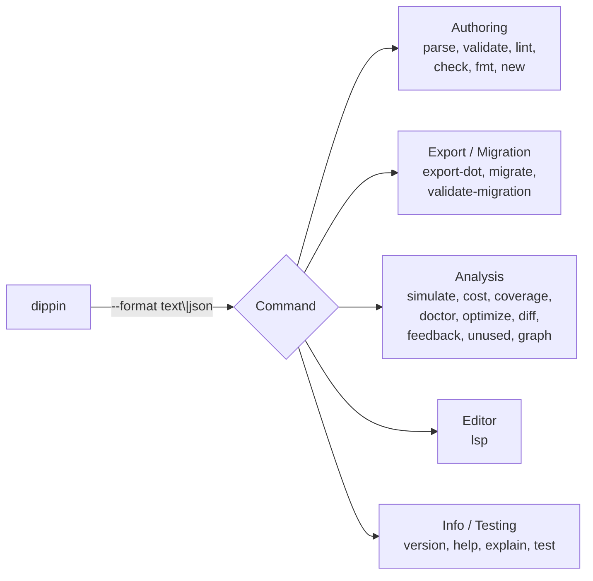

# CLI Reference

The `dippin` command-line tool provides parsing, validation, formatting, export, migration, analysis, and editor integration for `.dip` workflow files.

---

## Installation

Build from source:

```bash
go build -o dippin ./cmd/dippin
```

---

## Global Usage



```
dippin [--format text|json] <command> [args]
```

### Global Flags

| Flag | Values | Default | Description |
|------|--------|---------|-------------|
| `--format` | `text`, `json` | `text` | Output format for diagnostics. `text` produces human-readable output. `json` produces machine-readable arrays for CI/tooling integration. |

---

## Exit Codes

All commands use consistent exit codes:

| Code | Meaning |
|------|---------|
| `0` | Success — no issues found, operation completed |
| `1` | Error — validation failures, parse errors, check-mode drift, parity mismatches |
| `2` | Usage error — bad flags, missing arguments, unknown command |

---

## Commands

### parse

Parse a workflow file and output the intermediate representation (IR) as JSON.

```bash
dippin parse <file>
```

**Input**: `.dip` or `.dot` file (auto-detected by extension)

**Output**: Indented JSON representation of the `ir.Workflow` struct, printed to stdout. This is useful for debugging, tooling integration, and inspecting how the parser interprets your workflow.

**Example**:
```bash
dippin parse pipeline.dip
```

```json
{
  "Name": "my_pipeline",
  "Version": "",
  "Goal": "Do a thing",
  "Start": "Ask",
  "Exit": "Done",
  "Nodes": [ ... ],
  "Edges": [ ... ]
}
```

---

### validate

Run structural validation checks (DIP001–DIP009) on a workflow.

```bash
dippin validate <file>
```

**Input**: `.dip` or `.dot` file

**Checks**: The 9 structural validation rules that must pass for a workflow to be executable. See [validation.md](validation.md) for details on each code.

**Output**:
- If all checks pass: `"validation passed"` (text mode) or empty JSON array
- If errors found: diagnostic messages to stderr

**Example**:
```bash
$ dippin validate pipeline.dip
validation passed

$ dippin validate broken.dip
error[DIP003]: unknown node reference "InterpretX" in edge
  --> broken.dip:45:5
  = help: did you mean "Interpret"?
```

---

### lint

Run both structural validation and semantic linting (DIP001–DIP009 + DIP101–DIP122).

```bash
dippin lint <file>
```

**Input**: `.dip` or `.dot` file

**Checks**: All 32 diagnostic rules. Errors (DIP001–DIP009) cause exit code 1. Warnings (DIP101–DIP122) are reported but don't affect the exit code.

**Output**: All diagnostics (errors and warnings) to stderr.

**Example**:
```bash
$ dippin lint pipeline.dip
warning[DIP111]: tool command has no timeout
  --> pipeline.dip:35:3

$ echo $?
0    # warnings don't cause failure
```

---

### check

Parse, validate, and lint a workflow in one shot. Designed for LLM tool-calling loops and CI.

```bash
dippin check [--format json|text] <file>
```

**Default format**: `json` (unlike other commands which default to `text`). The `check` command parses its own `--format` flag, ignoring the global default.

**Output** (to stdout, not stderr):

```json
{
  "valid": false,
  "errors": 1,
  "warnings": 2,
  "diagnostics": [
    {"code": "DIP003", "severity": "error", "message": "unknown node reference \"Nope\" in edge", "line": 19, "fix": ""}
  ],
  "suggested_actions": []
}
```

| Field | Description |
|-------|-------------|
| `valid` | `true` if no errors (warnings allowed). Use this to decide whether to retry generation. |
| `errors` | Count of error-severity diagnostics |
| `warnings` | Count of warning-severity diagnostics |
| `diagnostics` | Array of all findings (code, severity, message, line, fix) |
| `suggested_actions` | Deduplicated non-empty `fix` strings from diagnostics |

**Text mode**: `dippin check --format text pipeline.dip` produces human-readable diagnostic output to stdout.

**Example**:
```bash
# LLM tool-calling loop:
dippin check generated.dip
# → {"valid":true,"errors":0,"warnings":0,"diagnostics":[],"suggested_actions":[]}

# Feed errors back to LLM for correction:
dippin check broken.dip | jq '.diagnostics[] | .message'
```

---

### new

Generate a starter `.dip` file from a built-in template.

```bash
dippin new [--name <name>] [--write <file>] <template>
```

**Flags**:

| Flag | Description |
|------|-------------|
| `--name <name>` | Override the workflow name (default: template name) |
| `--write <file>` | Write output to file instead of stdout |

**Available templates**:

| Template | Topology |
|----------|----------|
| `minimal` | `Start` → `Done` (two agent nodes) |
| `parallel` | `Init` → `parallel` → 2 workers → `fan_in` → `Done` |
| `conditional` | `Check` (auto_status) → `Pass`/`Fail` branching → `Done` |
| `review-loop` | `Implement` → `Review` → success: `Done` / fail: restart to `Implement` |
| `human-gate` | `Prepare` → human `Gate` (choice) → approve/reject → `Done` |

Templates are built programmatically from IR types and formatted via `formatter.Format()`, guaranteeing canonical output that always passes `dippin validate`.

**Examples**:
```bash
# Preview a template:
dippin new parallel

# Create a named workflow:
dippin new --name MyPipeline conditional --write my_pipeline.dip

# Generate and immediately validate:
dippin new review-loop --write /tmp/test.dip && dippin validate /tmp/test.dip
```

---

### fmt

Format a `.dip` file to canonical form.

```bash
dippin fmt [--check] [--write] <file>
```

**Flags**:

| Flag | Description |
|------|-------------|
| `--check` | Don't output anything. Exit 1 if the file is not already in canonical format. Useful for CI checks. |
| `--write` | Write the formatted output back to the source file in-place. |

**Default behavior** (no flags): Print the canonically formatted output to stdout.

**What canonical format means**:
- 2-space indentation
- Workflow header fields in standard order (goal, start, exit)
- Defaults block (if present) after header
- Node definitions ordered by kind
- Edges section at end
- Multiline fields (prompt, command) indented with `:` on the same line
- Deterministic, idempotent — formatting an already-formatted file produces identical output

**Examples**:
```bash
# Preview formatted output:
dippin fmt pipeline.dip

# Check in CI (fails if not formatted):
dippin fmt --check pipeline.dip

# Format in place:
dippin fmt --write pipeline.dip
```

---

### export-dot

Export a workflow to Graphviz DOT format for visualization.

```bash
dippin export-dot [--rankdir=LR|TB] [--prompts] <file>
```

**Flags**:

| Flag | Values | Default | Description |
|------|--------|---------|-------------|
| `--rankdir` | `LR`, `TB` | `TB` | Graph layout direction. `TB` = top-to-bottom, `LR` = left-to-right. |
| `--prompts` | — | off | Include full prompt and command text as DOT node attributes. By default, prompts are omitted for cleaner visualization. |

**Node Shape Mapping**:

| Node Kind | DOT Shape | Note |
|-----------|-----------|------|
| `agent` | `box` | |
| `human` | `hexagon` | |
| `tool` | `parallelogram` | |
| `parallel` | `component` | |
| `fan_in` | `tripleoctagon` | |
| `subgraph` | `tab` | |
| start node | `Mdiamond` | Regardless of kind |
| exit node | `Msquare` | Regardless of kind |

**Special styling**:
- Goal gate nodes get a red filled background
- Restart edges are rendered as dashed lines

**Example**:
```bash
# Generate DOT and render as PNG:
dippin export-dot pipeline.dip | dot -Tpng -o pipeline.png

# Left-to-right layout with prompts:
dippin export-dot --rankdir=LR --prompts pipeline.dip > pipeline.dot
```

---

### migrate

Convert a DOT file to `.dip` source format.

```bash
dippin migrate [--output <file>] <file.dot>
```

**Flags**:

| Flag | Description |
|------|-------------|
| `--output <file>` | Write output to the specified file instead of stdout. |

**What it does**:
1. Parses the DOT file using a custom DOT parser
2. Maps DOT shapes to Dippin node kinds
3. Extracts graph-level attributes into a `defaults` block
4. Unescapes prompt and command text from DOT string encoding
5. Prefixes bare condition variables with `ctx.` namespace
6. Identifies start/exit from `Mdiamond`/`Msquare` shapes
7. Outputs canonical `.dip` source

**Example**:
```bash
# Preview the migration:
dippin migrate old_pipeline.dot

# Write to file:
dippin migrate --output new_pipeline.dip old_pipeline.dot
```

---

### validate-migration

Check structural parity between a DOT file and a `.dip` file to verify migration correctness.

```bash
dippin validate-migration <old.dot> <new.dip>
```

**What it checks**: Compares the IR produced from both files and reports structural differences — missing nodes, different edges, changed conditions, etc.

**Output**:
- If equivalent: `"migration parity check passed"`
- If differences found: List of differences with categories

**Example**:
```bash
$ dippin validate-migration old.dot new.dip
migration parity check passed

$ dippin validate-migration old.dot broken.dip
parity check failed: 2 difference(s) found
  [node] missing node "ReviewStep" in new file
  [edge] edge Validate->Approve has different condition
```

---

### simulate

Dry-run a workflow's execution graph without calling LLMs or running commands. Emits JSONL events to stdout.

```bash
dippin simulate [--scenario key=val] [--interactive] [--all-paths] <file>
```

**Flags**:

| Flag | Description |
|------|-------------|
| `--scenario key=val` | Inject context values (repeatable). Use `NodeID.key=val` for per-node overrides. |
| `--interactive` | Prompt at human nodes instead of auto-selecting |
| `--all-paths` | Enumerate all possible paths through the graph |

**Output**: JSONL (one JSON object per line) with event types:

| Event | Fields | Description |
|-------|--------|-------------|
| `pipeline_start` | `run_id`, `workflow` | Simulation begins |
| `node_enter` | `node`, `kind`, `model`, `provider`, `prompt` | Node execution starts |
| `node_exit` | `node`, `status`, `duration_ms` | Node execution ends |
| `edge_traverse` | `from`, `to` | Edge followed |
| `pipeline_end` | `status`, `nodes_visited` | Simulation ends |

**Examples**:
```bash
# Default (all nodes succeed):
dippin simulate pipeline.dip

# Explore failure path:
dippin simulate pipeline.dip --scenario outcome=fail

# Fail only at a specific node:
dippin simulate pipeline.dip --scenario Validate.outcome=fail

# Count all possible paths:
dippin simulate pipeline.dip --all-paths
```

---

### cost

Estimate workflow execution cost based on model pricing tables.

```bash
dippin cost <file>
```

See [analysis.md](analysis.md#cost) for output format and JSON schema.

---

### coverage

Analyze edge coverage and reachability.

```bash
dippin coverage <file>
```

See [analysis.md](analysis.md#coverage) for output format and JSON schema.

---

### doctor

Health report card aggregating lint, coverage, and cost into a letter grade (A–F).

```bash
dippin doctor <file>
```

See [analysis.md](analysis.md#doctor) for scoring and output format.

---

### optimize

Suggest cheaper model substitutions.

```bash
dippin optimize <file>
```

See [analysis.md](analysis.md#optimize) for rules applied and output format.

---

### diff

Semantic comparison between two workflow versions.

```bash
dippin diff <old.dip> <new.dip>
```

See [analysis.md](analysis.md#diff) for output format and JSON schema.

---

### feedback

Compare predicted costs against actual execution telemetry.

```bash
dippin feedback <workflow.dip> <telemetry.csv>
```

See [analysis.md](analysis.md#feedback) for input format and output schema.

---

### explain

Print a detailed explanation for any diagnostic code.

```bash
dippin explain <DIPxxx>
```

**Input**: A diagnostic code string (e.g., `DIP101`, `DIP003`).

**Output**: Rich explanation including what triggers the diagnostic, how to fix it, and an example snippet.

**Example**:
```bash
$ dippin explain DIP101
═══ DIP101 ═════════════════════════════════════════
  unreachable node after conditional branches

  Trigger: A node follows conditional branches that already cover all outcomes.
  Fix:     Route the node through a condition, or remove it if unreachable.

  Example:
    A -> B [success]
    A -> C [failure]
    A -> D  // unreachable
```

In JSON mode, outputs the `Explanation` struct with `code`, `summary`, `trigger`, `fix`, and `example` fields.

---

### unused

Detect dead-branch nodes — reachable from start but with no path to exit — and estimate wasted cost.

```bash
dippin unused <file>
```

**Input**: `.dip` or `.dot` file.

**Output**: List of unused (sink) nodes with their kind, label, and estimated wasted cost per run.

**Example**:
```bash
$ dippin unused pipeline.dip
═══ Unused Nodes ══════════════════════════════════════════
  ✗ DeadEnd                      agent  (Dead End)
─── Wasted Cost ───────────────────────────────────────────
  $0.05 - $0.12 estimated wasted per run
─── Summary ───────────────────────────────────────────────
  1 unused node(s) found
```

---

### graph

Render a terminal-friendly ASCII DAG of the workflow.

```bash
dippin graph [--compact] <file>
```

**Flags**:

| Flag | Description |
|------|-------------|
| `--compact` | Single-line format: `[Start] → [Middle] → [Exit]` |

**Output**: ASCII box-drawing diagram showing topological layers. In JSON mode, outputs the layer structure.

**Example**:
```bash
$ dippin graph pipeline.dip
  ┌──────────┐
  │  Start   │
  └──────────┘
       │
       ▼
  ┌──────────┐
  │  Middle  │
  └──────────┘
       │
       ▼
  ┌──────────┐
  │   Exit   │
  └──────────┘

$ dippin graph --compact pipeline.dip
[Start] → [Middle] → [Exit]
```

---

### lsp

Start a Language Server Protocol server on stdio.

```bash
dippin lsp
```

Provides real-time diagnostics, hover, go-to-definition, autocomplete, and document symbols. See [editor-setup.md](editor-setup.md) for editor configuration.

---

### version

Show version information.

```bash
dippin version
```

---

### help

Display global usage and command list.

```bash
dippin help
```

---

## JSON Output Mode

All commands support `--format json` for machine-readable output. Diagnostics are emitted as a JSON array:

```bash
dippin --format json lint pipeline.dip
```

```json
[
  {
    "code": "DIP111",
    "severity": "warning",
    "message": "tool command has no timeout",
    "location": {
      "file": "pipeline.dip",
      "line": 35,
      "column": 3,
      "end_line": 0,
      "end_column": 0
    },
    "help": "add a timeout field"
  }
]
```

---

## Auto-Detection

The CLI auto-detects input format by file extension:
- `.dip` — Parsed by the Dippin parser
- `.dot` — Parsed by the DOT migration parser

This applies to all commands that accept a file argument (`parse`, `validate`, `lint`, `export-dot`). The `migrate` command always expects a `.dot` input, and `fmt` always expects `.dip`.
