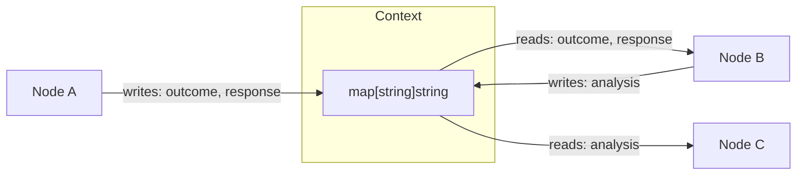
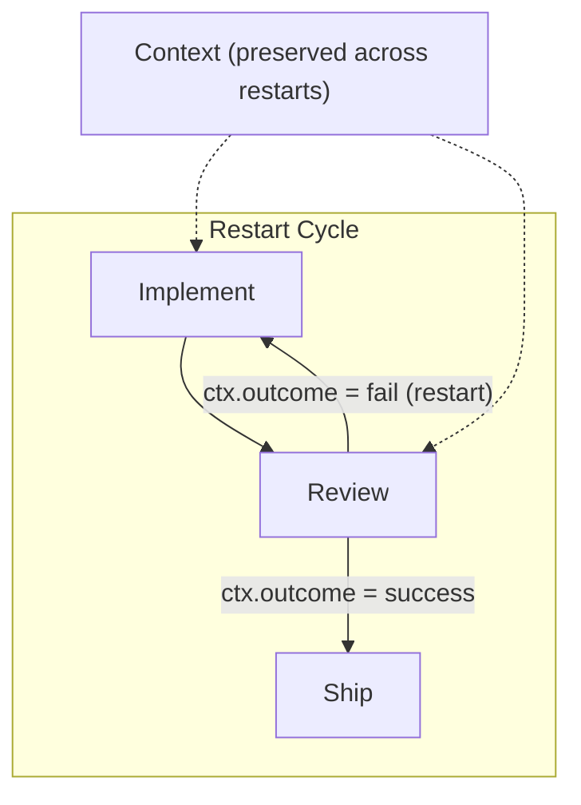

# Context and Variables Reference

Context is the shared state that flows between nodes during workflow execution. It's how nodes communicate — one node writes data, another reads it.

---

## How Context Works

At runtime, context is a `map[string]string` — a flat key-value store threaded through all nodes. When a node executes, it:

1. **Reads** values from context (e.g., the previous node's response)
2. **Processes** something (LLM call, human input, shell command)
3. **Writes** new values back to context (e.g., its output)

The next node in the pipeline sees the updated context.



---

## Variable Namespaces

In `.dip` source files, variables use explicit namespaces for clarity and validation. There are three namespaces:

### ctx — Runtime Context

The primary namespace. Contains handler outputs and reserved keys.

| Variable | Set By | Description |
|----------|--------|-------------|
| `ctx.outcome` | Engine / auto_status | Last node's execution status: `"success"`, `"fail"`, or `"retry"` |
| `ctx.last_response` | Agent nodes | The LLM's most recent response text |
| `ctx.human_response` | Human nodes | The human's input text |
| `ctx.tool_stdout` | Tool nodes | Standard output from the shell command |
| `ctx.tool_stderr` | Tool nodes | Standard error from the shell command |
| `ctx.preferred_label` | Engine | Edge routing hint from the handler's outcome |

These reserved keys are **always available** — the validator knows about them at parse time and can flag typos.

Custom context keys written by nodes (via the engine's `ContextUpdates`) also live in the `ctx` namespace.

### graph — Workflow Attributes

Read-only attributes from the workflow definition:

| Variable | Source | Description |
|----------|--------|-------------|
| `graph.goal` | Workflow header | The workflow's goal string |
| `graph.name` | Workflow header | The workflow's name |
| `graph.start` | Workflow header | The start node ID |
| `graph.exit` | Workflow header | The exit node ID |

Graph attributes are auto-injected into context with the `graph.` prefix.

### params — Subgraph Parameters

Available inside subgraph workflows. These are the parameters passed from the parent workflow:

```dippin
# Parent workflow:
  subgraph SecurityScan
    ref: security/scan_pipeline
    params:
      severity: critical
      model: gpt-5.4

# Inside security/scan_pipeline.dip:
  agent Scanner
    model: ${params.model}
    prompt:
      Scan for ${params.severity} vulnerabilities.
```

Parameters are substituted at expansion time — they don't persist in runtime context.

---

## Using Variables in Prompts

Reference context variables in prompts using `${namespace.key}` syntax:

```dippin
  agent Summarize
    prompt:
      The user asked: ${ctx.human_response}

      Previous analysis: ${ctx.last_response}

      Our goal is: ${graph.goal}
```

---

## Using Variables in Conditions

Edge conditions reference the same namespaced variables:

```dippin
  edges
    Check -> Pass when ctx.outcome = success
    Check -> Fail when ctx.outcome = fail
    Route -> A    when ctx.tool_stdout contains "ready"
    Route -> B    when graph.goal contains "review"
```

---

## I/O Declarations (reads/writes)

Nodes can declare which context keys they expect and produce. These are **advisory** — they're used by the linter, not enforced at runtime.

```dippin
  agent Interpret
    reads: human_response
    writes: plan, summary
    prompt:
      Based on the user input, create a plan.
```

**Important**: Use bare key names in `reads`/`writes`, not namespaced:
- Correct: `reads: human_response`
- Incorrect: `reads: ctx.human_response`

The linter uses these declarations for:
- **DIP107**: Detecting writes that no downstream node reads
- **DIP112**: Detecting reads that no upstream node writes
- **DIP106**: Detecting undefined variable references in prompts

---

## Namespace Lowering

At the IR-to-engine boundary, namespaces are translated to flat keys:

| Dippin syntax | Engine context key |
|---------------|-------------------|
| `ctx.outcome` | `outcome` |
| `ctx.last_response` | `last_response` |
| `ctx.custom_key` | `custom_key` |
| `graph.goal` | `graph.goal` (already prefixed) |
| `params.model` | Substituted at expansion time |

This is transparent to workflow authors — you always use namespaced syntax in `.dip` files.

---

## Context Preservation Across Restarts



When a restart edge is followed, context is **fully preserved**. All key-values survive across restarts. This is intentional — it enables iterative refinement patterns:

```dippin
  # First iteration: Implement writes code, Review writes feedback
  # Restart: Implement sees the feedback, writes better code
  edges
    Implement -> Review
    Review -> Implement when ctx.outcome = fail restart: true
    Review -> Ship      when ctx.outcome = success
```

What **is** cleared on restart:
- Completed node status (downstream nodes re-execute)
- Retry counts for cleared nodes (fresh budgets)
- Node-local `SessionStats` (fresh stats per re-execution)

What **survives**:
- All context key-values
- The global restart counter (increments toward `max_restarts`)

---

## Validation Tiers

The validator treats variables differently based on what it can verify at parse time:

| Tier | Variables | Validation |
|------|-----------|------------|
| **Always known** | `ctx.outcome`, `ctx.last_response`, `ctx.human_response`, `ctx.tool_stdout`, `ctx.tool_stderr`, `graph.goal` | Error if misspelled |
| **Declared outputs** | Keys from upstream `writes` declarations | Warning if referenced but not declared (DIP112) |
| **Dynamic** | Everything else | Warning only — never an error (runtime context is open) |

This tiered approach catches typos in common variables while allowing flexibility for custom context keys.
