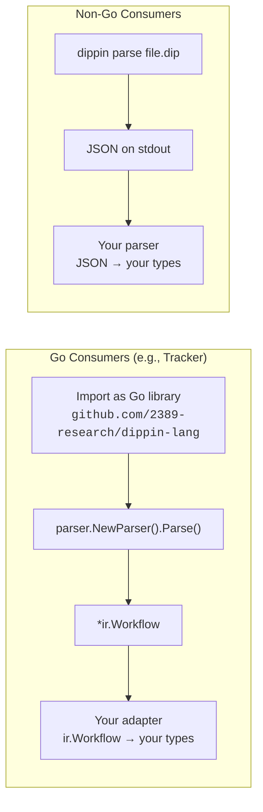
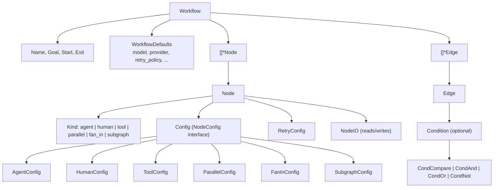
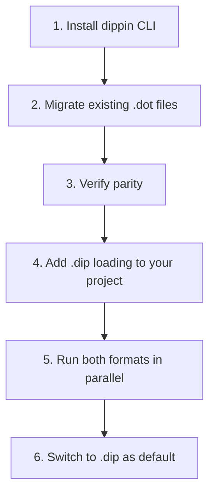

# Integration Guide

How to consume Dippin workflows from external projects — as a Go library, via CLI tooling, or both.

---

## Overview

Dippin provides two integration paths:



| Path | When to use | Pros | Cons |
|------|-------------|------|------|
| **Go library** | Your project is in Go | Type-safe, no subprocess overhead, access to all IR types | Adds a Go module dependency |
| **CLI (JSON)** | Any language, CI pipelines, scripting | Language-agnostic, no build dependency | Subprocess overhead, JSON parsing required |

For Go projects like Tracker, **use both**: the library for production integration, the CLI for development tooling (formatting, linting, DOT export).

---

## Go Library Integration

### Installation

```bash
go get github.com/2389-research/dippin-lang
```

### Package Overview

| Package | Import | Purpose |
|---------|--------|---------|
| `ir` | `github.com/2389-research/dippin-lang/ir` | All IR types (Workflow, Node, Edge, conditions, configs) |
| `parser` | `github.com/2389-research/dippin-lang/parser` | Parse `.dip` source → `*ir.Workflow` |
| `validator` | `github.com/2389-research/dippin-lang/validator` | Structural validation + semantic linting |
| `formatter` | `github.com/2389-research/dippin-lang/formatter` | IR → canonical `.dip` source text |
| `export` | `github.com/2389-research/dippin-lang/export` | IR → Graphviz DOT format |
| `migrate` | `github.com/2389-research/dippin-lang/migrate` | DOT → IR conversion (for migration) |

### Parsing a .dip File

```go
import (
    "os"
    "github.com/2389-research/dippin-lang/parser"
)

data, err := os.ReadFile("pipeline.dip")
if err != nil {
    return err
}

p := parser.NewParser(string(data), "pipeline.dip")
workflow, err := p.Parse()
if err != nil {
    return err // parse error with source location
}

// workflow is *ir.Workflow — the canonical IR
fmt.Println(workflow.Name)   // "my_pipeline"
fmt.Println(workflow.Start)  // "AskUser"
fmt.Println(workflow.Exit)   // "Done"
```

### Validating a Workflow

```go
import "github.com/2389-research/dippin-lang/validator"

// Structural checks (DIP001–DIP009) — must pass
result := validator.Validate(workflow)
if result.HasErrors() {
    for _, d := range result.Diagnostics {
        fmt.Println(d.String())
        // error[DIP003]: unknown node reference "InterpretX" in edge
        //   --> pipeline.dip:45:5
        //   = help: did you mean "Interpret"?
    }
}

// Semantic lint (DIP101–DIP112) — warnings
lintResult := validator.Lint(workflow)
for _, d := range lintResult.Diagnostics {
    fmt.Println(d.String())
}
```

### Formatting and Exporting

```go
import (
    "github.com/2389-research/dippin-lang/formatter"
    "github.com/2389-research/dippin-lang/export"
)

// Round-trip: IR → canonical .dip source
canonical := formatter.Format(workflow)

// IR → Graphviz DOT
dot := export.ExportDOT(workflow, export.ExportOptions{
    RankDir:        "LR",
    IncludePrompts: true,
})
```

---

## The IR Type System

The `ir.Workflow` is the central type all integration code works with. Understanding it is critical for writing adapters.

### Workflow Structure



### Node Kind → Config Type Mapping

Each node kind has exactly one config type. Use a type switch to access kind-specific fields:

```go
switch cfg := node.Config.(type) {
case ir.AgentConfig:
    fmt.Println(cfg.Prompt)
    fmt.Println(cfg.Model)
    fmt.Println(cfg.GoalGate)
case ir.HumanConfig:
    fmt.Println(cfg.Mode)    // "choice" or "freeform"
    fmt.Println(cfg.Default)
case ir.ToolConfig:
    fmt.Println(cfg.Command)
    fmt.Println(cfg.Timeout)
case ir.ParallelConfig:
    fmt.Println(cfg.Targets) // []string of node IDs
case ir.FanInConfig:
    fmt.Println(cfg.Sources) // []string of node IDs
case ir.SubgraphConfig:
    fmt.Println(cfg.Ref)
    fmt.Println(cfg.Params)
}
```

### Lookup Helpers

The `ir.Workflow` type provides convenience methods for graph traversal:

```go
node := workflow.Node("Analyze")         // find by ID
outgoing := workflow.EdgesFrom("Analyze") // all edges leaving this node
incoming := workflow.EdgesTo("Analyze")   // all edges entering this node
ids := workflow.NodeIDs()                 // all IDs in declaration order
```

---

## Writing an Adapter (Tracker Example)

The recommended pattern: your project imports dippin-lang and converts `*ir.Workflow` into your own types. This keeps dippin-lang generic and your project in control of the mapping.

### Tracker's Current Types

Tracker uses `pipeline.Graph`, `pipeline.Node`, and `pipeline.Edge` with a shape-to-handler mapping:

```go
// Tracker's types (simplified)
type Graph struct {
    Name, StartNode, ExitNode string
    Nodes map[string]*Node
    Edges []*Edge
    Attrs map[string]string
}

type Node struct {
    ID, Shape, Label, Handler string
    Attrs map[string]string
}

type Edge struct {
    From, To, Label, Condition string
    Attrs map[string]string
}
```

### Adapter: ir.Workflow → pipeline.Graph

```go
package pipeline

import (
    "fmt"
    "github.com/2389-research/dippin-lang/ir"
)

// kindToShape maps Dippin node kinds back to DOT shapes
// that Tracker's handler registry understands.
var kindToShape = map[ir.NodeKind]string{
    ir.NodeAgent:    "box",
    ir.NodeHuman:    "hexagon",
    ir.NodeTool:     "parallelogram",
    ir.NodeParallel: "component",
    ir.NodeFanIn:    "tripleoctagon",
    ir.NodeSubgraph: "tab",
}

// FromDippinIR converts a Dippin IR workflow into a Tracker Graph.
// The returned Graph is ready for use with NewEngine and the handler registry.
func FromDippinIR(w *ir.Workflow) *Graph {
    g := NewGraph(w.Name)

    // Map workflow-level defaults to graph attributes.
    if w.Goal != "" {
        g.Attrs["goal"] = w.Goal
    }
    if w.Defaults.Model != "" {
        g.Attrs["llm_model"] = w.Defaults.Model
    }
    if w.Defaults.Provider != "" {
        g.Attrs["llm_provider"] = w.Defaults.Provider
    }
    if w.Defaults.RetryPolicy != "" {
        g.Attrs["default_retry_policy"] = w.Defaults.RetryPolicy
    }
    if w.Defaults.MaxRetries > 0 {
        g.Attrs["default_max_retry"] = fmt.Sprintf("%d", w.Defaults.MaxRetries)
    }
    if w.Defaults.MaxRestarts > 0 {
        g.Attrs["max_restarts"] = fmt.Sprintf("%d", w.Defaults.MaxRestarts)
    }

    // Convert nodes.
    for _, n := range w.Nodes {
        node := &Node{
            ID:    n.ID,
            Label: n.Label,
            Shape: kindToShape[n.Kind],
            Attrs: make(map[string]string),
        }

        // Start/exit get special shapes.
        if n.ID == w.Start {
            node.Shape = "Mdiamond"
        }
        if n.ID == w.Exit {
            node.Shape = "Msquare"
        }

        // Extract kind-specific attributes.
        switch cfg := n.Config.(type) {
        case ir.AgentConfig:
            if cfg.Prompt != "" {
                node.Attrs["prompt"] = cfg.Prompt
            }
            if cfg.SystemPrompt != "" {
                node.Attrs["system_prompt"] = cfg.SystemPrompt
            }
            if cfg.Model != "" {
                node.Attrs["llm_model"] = cfg.Model
            }
            if cfg.Provider != "" {
                node.Attrs["llm_provider"] = cfg.Provider
            }
            if cfg.MaxTurns > 0 {
                node.Attrs["max_turns"] = fmt.Sprintf("%d", cfg.MaxTurns)
            }
            if cfg.GoalGate {
                node.Attrs["goal_gate"] = "true"
            }
            if cfg.AutoStatus {
                node.Attrs["auto_status"] = "true"
            }
            if cfg.ReasoningEffort != "" {
                node.Attrs["reasoning_effort"] = cfg.ReasoningEffort
            }
            if cfg.Fidelity != "" {
                node.Attrs["fidelity"] = cfg.Fidelity
            }
        case ir.HumanConfig:
            if cfg.Mode != "" {
                node.Attrs["mode"] = cfg.Mode
            }
            if cfg.Default != "" {
                node.Attrs["default"] = cfg.Default
            }
        case ir.ToolConfig:
            if cfg.Command != "" {
                node.Attrs["tool_command"] = cfg.Command
            }
            if cfg.Timeout > 0 {
                node.Attrs["timeout"] = cfg.Timeout.String()
            }
        case ir.ParallelConfig:
            // Targets are expressed via edges, not attributes.
        case ir.FanInConfig:
            // Sources are expressed via edges, not attributes.
        case ir.SubgraphConfig:
            if cfg.Ref != "" {
                node.Attrs["subgraph_ref"] = cfg.Ref
            }
        }

        // Retry config.
        if n.Retry.Policy != "" {
            node.Attrs["retry_policy"] = n.Retry.Policy
        }
        if n.Retry.MaxRetries > 0 {
            node.Attrs["max_retries"] = fmt.Sprintf("%d", n.Retry.MaxRetries)
        }

        g.AddNode(node)
    }

    // Convert edges.
    for _, e := range w.Edges {
        edge := &Edge{
            From:  e.From,
            To:    e.To,
            Label: e.Label,
            Attrs: make(map[string]string),
        }

        // Flatten condition AST back to string for Tracker's engine.
        if e.Condition != nil {
            edge.Condition = e.Condition.Raw
        }

        if e.Restart {
            edge.Attrs["restart"] = "true"
        }
        if e.Weight > 0 {
            edge.Attrs["weight"] = fmt.Sprintf("%d", e.Weight)
        }

        g.AddEdge(edge)
    }

    return g
}
```

### Using the Adapter

Replace the file-loading code to auto-detect format:

```go
import (
    "path/filepath"
    "strings"

    "github.com/2389-research/dippin-lang/parser"
    "github.com/2389-research/dippin-lang/validator"
)

func LoadPipeline(path string) (*Graph, error) {
    data, err := os.ReadFile(path)
    if err != nil {
        return nil, err
    }

    ext := strings.ToLower(filepath.Ext(path))
    switch ext {
    case ".dip":
        p := parser.NewParser(string(data), path)
        w, err := p.Parse()
        if err != nil {
            return nil, fmt.Errorf("dippin parse error: %w", err)
        }

        // Validate before converting.
        result := validator.Validate(w)
        if result.HasErrors() {
            return nil, fmt.Errorf("validation failed: %s", result.Diagnostics[0].String())
        }

        return FromDippinIR(w), nil

    case ".dot":
        return ParseDOT(string(data))

    default:
        return nil, fmt.Errorf("unsupported file extension: %s", ext)
    }
}
```

This is a **zero-disruption migration**: existing `.dot` files keep working, `.dip` files are supported alongside, and the engine doesn't know the difference.

---

## CLI Integration (Non-Go)

For projects not written in Go, the `dippin` CLI provides JSON output suitable for any language.

### Parse to JSON

```bash
dippin parse pipeline.dip
```

Outputs the full IR as JSON to stdout:

```json
{
  "Name": "my_pipeline",
  "Goal": "Ask user for a task",
  "Start": "AskUser",
  "Exit": "Done",
  "Defaults": {
    "Model": "claude-opus-4-6",
    "Provider": "anthropic"
  },
  "Nodes": [
    {
      "ID": "AskUser",
      "Kind": "human",
      "Label": "What would you like to build?",
      "Config": {
        "Mode": "freeform"
      }
    }
  ],
  "Edges": [
    {
      "From": "AskUser",
      "To": "Interpret",
      "Condition": null
    }
  ]
}
```

### Validate Before Use

```bash
# Structural validation (exit code 0 = pass, 1 = fail)
dippin validate pipeline.dip

# Full lint with JSON diagnostics for machine parsing
dippin --format json lint pipeline.dip
```

### Format and Export

```bash
# Canonical formatting (for CI checks)
dippin fmt --check pipeline.dip

# Export to DOT for visualization
dippin export-dot pipeline.dip | dot -Tpng -o pipeline.png
```

### Example: Python Consumer

```python
import json
import subprocess

def load_dippin(path: str) -> dict:
    result = subprocess.run(
        ["dippin", "parse", path],
        capture_output=True, text=True
    )
    if result.returncode != 0:
        raise ValueError(f"Parse failed: {result.stderr}")
    return json.loads(result.stdout)

workflow = load_dippin("pipeline.dip")
for node in workflow["Nodes"]:
    print(f"{node['Kind']}: {node['ID']}")
```

### Example: TypeScript/Node Consumer

```typescript
import { execFileSync } from "child_process";

function loadDippin(path: string): Workflow {
  const stdout = execFileSync("dippin", ["parse", path], {
    encoding: "utf-8",
  });
  return JSON.parse(stdout);
}
```

---

## Migration Path

For projects currently consuming DOT files, Dippin provides a smooth migration:



### Step 1: Install the CLI

```bash
go install github.com/2389-research/dippin-lang/cmd/dippin@latest
```

### Step 2: Migrate existing DOT files

```bash
dippin migrate --output pipeline.dip pipeline.dot
```

### Step 3: Verify structural parity

```bash
dippin validate-migration pipeline.dot pipeline.dip
# Output: "migration parity check passed"
```

### Step 4: Add .dip loading

Add the adapter code (see above) or CLI integration to your project. Support both `.dot` and `.dip` during transition.

### Step 5: Run both formats

Keep both files during the transition period. Author new pipelines in `.dip`. Validate that existing workflows behave identically.

### Step 6: Switch to .dip as default

Once confident, make `.dip` the default format. Keep DOT as an export target for visualization:

```bash
dippin export-dot pipeline.dip | dot -Tpng -o pipeline.png
```

---

## CI Integration

### Format Check

Enforce canonical formatting in CI:

```yaml
- name: Check Dippin formatting
  run: dippin fmt --check pipeline.dip
```

### Lint Check

Catch structural errors and warnings:

```yaml
- name: Lint Dippin workflows
  run: dippin lint pipeline.dip
```

### JSON Diagnostics for Annotations

Use JSON output for GitHub Actions annotations or similar:

```yaml
- name: Lint with JSON output
  run: dippin --format json lint pipeline.dip > diagnostics.json
```

---

## Condition String Compatibility

Tracker currently stores conditions as raw strings (`edge.Condition`). Dippin parses conditions into an AST but preserves the raw text in `Condition.Raw`. When adapting back to Tracker types, use the raw string:

```go
if e.Condition != nil {
    edge.Condition = e.Condition.Raw
}
```

**Namespace difference**: Dippin uses namespaced variables (`ctx.outcome`), while Tracker uses bare names (`outcome`) or prefixed names (`context.tool_stdout`). During migration, the `migrate` command handles the translation. When writing new `.dip` files, always use the `ctx.` namespace — the adapter should strip the prefix when converting to Tracker's format if needed.

---

## What Dippin Does NOT Provide

Dippin is a **language and toolchain**, not a runtime. It does not:

- Execute workflows
- Manage pipeline state or checkpoints
- Call LLM APIs
- Handle human interaction UI
- Run shell commands

These responsibilities stay in the consuming project (e.g., Tracker's engine, handler registry, and TUI). Dippin's job is to parse, validate, format, and export — the consuming project does everything else.
