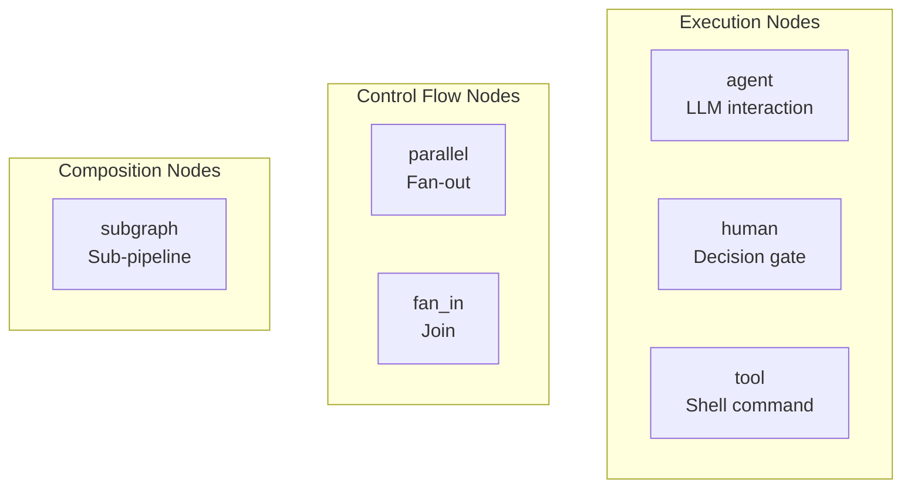
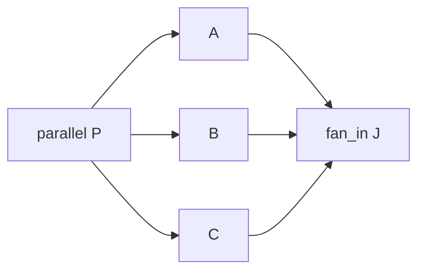

# Node Reference

Nodes are the building blocks of a Dippin workflow. Each node represents a single step in the pipeline — an LLM call, a human decision, a shell command, or a control-flow construct.

---

## Node Kinds

There are 6 node kinds, each with its own syntax and configuration:



| Kind | Purpose | Syntax |
|------|---------|--------|
| `agent` | LLM interaction | Block with prompt |
| `human` | Human decision gate | Block with mode |
| `tool` | Shell command execution | Block with command |
| `parallel` | Fan-out to concurrent branches | Inline declaration |
| `fan_in` | Join concurrent branches | Inline declaration |
| `subgraph` | Embed a sub-pipeline | Block with ref |

---

## Common Fields

These fields are available on **all** block-style node kinds (agent, human, tool, subgraph):

| Field | Type | Required | Description |
|-------|------|----------|-------------|
| `label` | String | No | Human-readable display name. Shown in DOT exports and UI. Defaults to the node ID if omitted. |
| `class` | CSV | No | Comma-separated stylesheet class names for theming (reserved for post-v1). |
| `reads` | CSV | No | Context keys this node expects to read. Advisory — used for linting (DIP112), not enforced at runtime. |
| `writes` | CSV | No | Context keys this node will produce. Advisory — used for linting (DIP107), not enforced at runtime. |
| `retry_policy` | String | No | Named retry strategy: `"standard"`, `"aggressive"`, `"patient"`, `"linear"`, `"none"`. Overrides the workflow default. |
| `max_retries` | Integer | No | Maximum retry attempts before giving up. Overrides the workflow default. |
| `base_delay` | Duration | No | Override the retry policy's default base delay (e.g. `500ms`, `2s`, `1m`). |
| `retry_target` | String | No | Node ID to jump to when retrying (instead of re-executing the current node). |
| `fallback_target` | String | No | Node ID to jump to if all retries are exhausted. |

### reads and writes

These are **advisory I/O declarations**. They tell the linter what context keys a node expects and produces, enabling checks like:

- **DIP112**: A node declares `reads: plan` but no upstream node declares `writes: plan`
- **DIP107**: A node declares `writes: summary` but no downstream node reads it

Use bare key names (not namespaced): `reads: human_response`, not `reads: ctx.human_response`.

```dippin
  agent Interpret
    reads: human_response
    writes: plan, summary
    prompt:
      Based on the user's response, create a plan.
```

---

## Agent Nodes

Agent nodes invoke an LLM. They are the most configurable node kind.

```dippin
  agent Analyze
    label: "Analyze the request"
    model: claude-opus-4-6
    provider: anthropic
    max_turns: 3
    reasoning_effort: high
    goal_gate: true
    auto_status: true
    reads: human_response
    writes: analysis
    prompt:
      You are a senior software architect.
      Analyze the following request carefully.

      ## User Request
      ${ctx.human_response}
    system_prompt:
      Always respond in structured markdown.
```

### Agent-Specific Fields

| Field | Type | Default | Description |
|-------|------|---------|-------------|
| `prompt` | Multiline | — | The main prompt sent to the LLM. This is the primary instruction for what the agent should do. Supports context variable interpolation with `${ctx.key}` syntax. |
| `system_prompt` | Multiline | — | System-level instructions passed separately to the LLM. Has higher behavioral precedence than the user prompt. Used for persistent rules like output format or persona. |
| `model` | String | workflow default | LLM model identifier (e.g., `"claude-opus-4-6"`, `"gpt-5.4"`). Overrides the workflow-level default. |
| `provider` | String | workflow default | LLM provider (e.g., `"anthropic"`, `"openai"`, `"gemini"`). Overrides the workflow-level default. |
| `max_turns` | Integer | 1 | Maximum conversation turns in an agentic loop. A turn is one request-response cycle. Set higher for multi-step tool-using agents. |
| `cmd_timeout` | Duration | — | Timeout for tool/command execution within the agent's agentic loop. |
| `cache_tools` | Boolean | workflow default | Whether to cache tool call results for this agent. Useful for expensive, deterministic tools. |
| `compaction` | String | workflow default | Context compaction mode for managing long context windows. |
| `compaction_threshold` | Float | — | Threshold value that triggers compaction (provider-specific semantics). |
| `reasoning_effort` | String | — | Extended thinking effort level (provider-specific, e.g., `"high"`, `"medium"`, `"low"`). Controls how much reasoning budget the LLM spends. |
| `fidelity` | String | workflow default | Checkpoint fidelity level for this node's state. |
| `auto_status` | Boolean | false | When true, the engine parses `STATUS: <status>` from the LLM response to set `ctx.outcome`. This enables automatic routing based on the agent's self-assessment. |
| `goal_gate` | Boolean | false | When true, this node is a "goal gate" — if it fails (outcome != success), the entire pipeline fails even if execution reaches the exit node. Used for critical quality checks. |

### auto_status

When `auto_status: true`, the engine scans the agent's response for a line matching `STATUS: <value>`. The value becomes `ctx.outcome`. This enables conditional routing without separate evaluation:

```dippin
  agent Validate
    auto_status: true
    prompt:
      Review the code. End your response with:
      STATUS: success (if all tests pass)
      STATUS: fail (if any test fails)

  edges
    Validate -> Approve when ctx.outcome = success
    Validate -> Fix     when ctx.outcome = fail
```

### goal_gate

Goal gates are pipeline-critical nodes. Even if execution eventually reaches the exit node, the pipeline is marked as failed if any goal gate node had a non-success outcome.

```dippin
  agent SecurityReview
    goal_gate: true
    prompt:
      Review for security vulnerabilities.
      This review MUST pass for the pipeline to succeed.
```

In DOT export, goal gate nodes are highlighted with a red filled background.

---

## Human Nodes

Human nodes pause execution and wait for human input. They support three interaction modes.

```dippin
  human Approve
    label: "Ship it?"
    mode: choice
    default: "yes"
```

### Human-Specific Fields

| Field | Type | Default | Description |
|-------|------|---------|-------------|
| `mode` | String | — | Interaction mode: `"choice"` (select from edge labels), `"freeform"` (open text), or `"interview"` (structured Q&A from upstream agent output). |
| `default` | String | — | Default selection if no input. Only meaningful for `"choice"` mode. |
| `questions_key` | String | `interview_questions` | Context key to read questions from. Interview mode only. |
| `answers_key` | String | `interview_answers` | Context key to write answers to. Interview mode only. |

### Choice Mode

In `choice` mode, the available choices come from the **labels on outgoing edges**:

```dippin
  human Review
    mode: choice
    default: "approve"

  edges
    Review -> Approved  label: "approve"
    Review -> Rejected  label: "reject"
    Review -> Revise    label: "revise"
```

The human sees three buttons: "approve", "reject", "revise". Their selection determines which edge is followed.

### Freeform Mode

In `freeform` mode, the human can type any text. The input is stored in `ctx.human_response` and available to downstream nodes:

```dippin
  human AskUser
    label: "What would you like to build?"
    mode: freeform

  agent Interpret
    reads: human_response
    prompt:
      The user said: ${ctx.human_response}
```

### Interview Mode

In `interview` mode, the runtime extracts questions from the upstream agent's output and presents each as an individual form field. Questions with inline options (e.g., "Auth model? (API key, OAuth, JWT)") are shown as selection lists with an "Other (freeform)" escape hatch. Pure text questions become text areas.

```dippin
  human AnswerQuestions
    label: "Answer the interviewer's questions."
    mode: interview
    questions_key: interview_questions
    answers_key: interview_answers
    reads: interview_questions
    writes: interview_answers
    prompt:
      If no questions were detected, describe your
      requirements here instead.
```

**How it works:**

1. The upstream agent writes its output (containing questions) to the context key specified by `questions_key`.
2. The runtime parses the output for questions — numbered lists, lines ending in `?`, and imperative prompts ("Describe...", "List...").
3. Inline options in parentheses (e.g., `(API key, OAuth, JWT)`) become selection choices with an additional "Other" freeform option.
4. Questions without options become text areas.
5. Answers are stored in `answers_key` as structured JSON and in `human_response` as markdown.

If the upstream output contains no parseable questions (e.g., the agent said "No further questions needed"), the runtime falls back to showing the `prompt` field as a single text area.

**Lint checks:** DIP127 (invalid mode), DIP128 (meaningless default on interview), DIP129 (conflicting labeled edges on interview).

---

## Tool Nodes

Tool nodes execute shell commands and capture their output.

```dippin
  tool RunTests
    label: "Run test suite"
    timeout: 60s
    command:
      #!/bin/sh
      set -eu
      pytest --tb=short 2>&1
```

### Tool-Specific Fields

| Field | Type | Default | Description |
|-------|------|---------|-------------|
| `command` | Multiline | — | Shell command(s) to execute. Supports full shell syntax including pipes, conditionals, and multi-line scripts. The command's stdout is captured as `ctx.tool_stdout` and stderr as `ctx.tool_stderr`. |
| `timeout` | Duration | — | Maximum execution time (e.g., `"30s"`, `"2m"`, `"1m30s"`). If the command exceeds this duration, it is killed. **Recommended** — the linter warns (DIP111) if omitted. |
| `outputs` | CSV | — | Declared possible stdout values (comma-separated). Used by `dippin coverage` to check whether outgoing edge conditions cover all tool outputs. Advisory — not enforced at runtime. |

### Command Output

After execution, the tool's output is available in context:
- `ctx.tool_stdout` — standard output
- `ctx.tool_stderr` — standard error

These can be used in downstream node prompts or edge conditions:

```dippin
  tool CheckStatus
    timeout: 10s
    command:
      curl -s https://api.example.com/status | jq -r '.state'

  edges
    CheckStatus -> Proceed when ctx.tool_stdout = "ready"
    CheckStatus -> Wait    when ctx.tool_stdout != "ready"
```

---

## Parallel Nodes

Parallel nodes fan execution out to multiple branches that run concurrently.

```dippin
  parallel FanOut -> TaskA, TaskB, TaskC
```

### Syntax

```
parallel <ID> -> <target1>, <target2>[, <target3>, ...]
```

- The `->` operator defines which nodes receive concurrent execution
- Targets must be existing node IDs
- Every `parallel` node **must** have a matching `fan_in` node (DIP007)

### How It Works

When execution reaches a parallel node, the engine launches all target nodes simultaneously. Each branch runs independently with its own copy of the context. The branches converge at the matching fan-in node.

---

## Fan-In Nodes

Fan-in nodes join concurrent branches back together.

```dippin
  fan_in Join <- TaskA, TaskB, TaskC
```

### Syntax

```
fan_in <ID> <- <source1>, <source2>[, <source3>, ...]
```

- The `<-` operator defines which nodes this join waits for
- Sources must match the targets of a corresponding `parallel` node
- The fan-in node blocks until **all** source nodes complete

### Parallel/Fan-In Pairing

Every parallel must have a matching fan-in. The target sets must be identical (order doesn't matter):



```dippin
  parallel P -> A, B, C
  # ... node definitions for A, B, C ...
  fan_in J <- A, B, C    # Must list the same nodes as P's targets
```

If the sets don't match, validation fails with DIP007.

### Edges

You need edges connecting the parallel node to its targets and the targets to the fan-in:

```dippin
  parallel P -> A, B
  agent A
    label: A
  agent B
    label: B
  fan_in J <- A, B

  edges
    P -> A
    P -> B
    A -> J
    B -> J
```

Some of these edges may be auto-generated by the parser if omitted.

---

## Subgraph Nodes

Subgraph nodes embed another workflow as a single step.

```dippin
  subgraph ReviewProcess
    ref: review_pipeline
    params:
      strict: true
      model: gpt-5.4
```

### Subgraph-Specific Fields

| Field | Type | Default | Description |
|-------|------|---------|-------------|
| `ref` | String | — | Name or file path of the workflow to embed. |
| `params` | Map | — | Key-value parameter overrides passed to the sub-workflow. Parameters are substituted via the `params.*` namespace in the embedded workflow. |

### Parameter Passing

Parameters let you customize a reusable workflow at invocation time:

```dippin
# In the parent workflow:
  subgraph SecurityScan
    ref: security/scan_pipeline
    params:
      severity: critical
      fail_fast: true
```

The embedded workflow can reference these via `${params.severity}`.

### Reusable Interview Loop

The `interview_loop.dip` example is a pre-built subgraph that collects structured requirements through iterative Q&A. It combines an LLM interviewer, an `interview` mode human node, and an assessor loop:

```dippin
  subgraph Requirements
    ref: interview_loop.dip
    reads: human_response
    writes: requirements_summary
    params:
      topic: "API design"
      focus: "resources, auth, scale, integrations"
```

The subgraph handles the full interview lifecycle: generating questions with suggested options, collecting structured answers via `huh` forms, assessing completeness, and looping until requirements are clear. See `examples/interview_loop.dip` for the full source.

---

## Node Declaration Order

Nodes can be declared in any order within the workflow. The `start` and `exit` fields (not declaration order) determine entry and exit points. However, the canonical formatter groups nodes by kind for readability.

---

## Duration Format

Fields that accept durations (like `timeout` and `cmd_timeout`) use Go's duration format:
- `30s` — 30 seconds
- `2m` — 2 minutes
- `1m30s` — 1 minute 30 seconds
- `500ms` — 500 milliseconds
