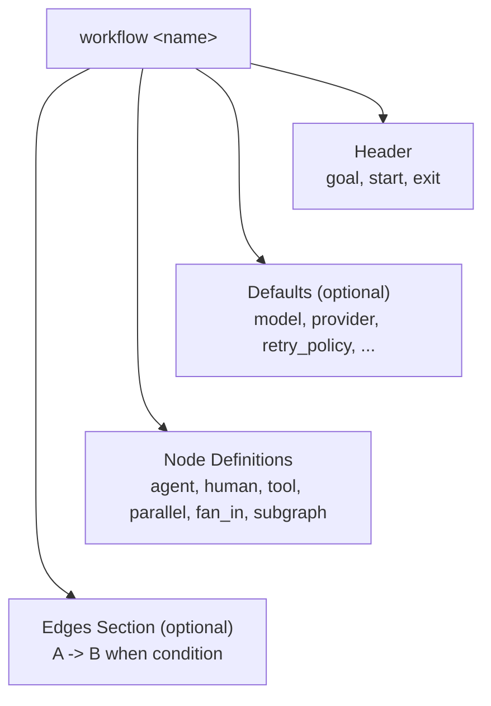

# Dippin Language Syntax Reference

This document describes the complete syntax of the `.dip` file format — the human-friendly alternative to DOT for authoring AI-driven workflow pipelines.

---

## File Structure

Every `.dip` file contains exactly one workflow. The top-level structure is:



```dippin
workflow <name>
  <header fields>

  [defaults]
    <key: value pairs>

  <node definitions>

  [edges]
    <edge definitions>
```

Sections must appear in this order: header, defaults, nodes, edges.

---

## Indentation

Dippin uses **indentation-sensitive syntax** (like Python). Indentation defines scope — child elements are indented relative to their parent.

- Use **2 spaces** or **tabs** consistently (do not mix)
- The canonical formatter always outputs 2-space indentation
- Indentation level changes produce `INDENT` / `OUTDENT` tokens internally

```dippin
workflow Example         # level 0
  goal: "Do a thing"    # level 1 (child of workflow)
  start: A

  agent A                # level 1 (child of workflow)
    prompt:              # level 2 (child of agent A)
      Hello world        # level 3 (multiline content)
```

---

## Comments

Line comments start with `#` and extend to the end of the line. They are ignored by the parser.

```dippin
# This is a comment
workflow Example   # Inline comment
  start: A
```

Section headers like `# ── Phase 1 ──────────` are purely decorative — the parser treats them as regular comments.

---

## Workflow Header

The workflow declaration is the first line, followed by required and optional header fields:

```dippin
workflow my_pipeline
  goal: "Ask user for a task, implement it, review, ship"
  start: AskUser
  exit: Done
```

| Field | Required | Description |
|-------|----------|-------------|
| `workflow <name>` | Yes | Declares the workflow and its identifier |
| `goal: <text>` | No | Human-readable objective for this pipeline |
| `start: <NodeID>` | Yes | Entry point node — execution begins here |
| `exit: <NodeID>` | Yes | Terminal node — execution ends here |

The name on the `workflow` line is an identifier (alphanumeric, underscores, dashes). Goal is a quoted or unquoted string.

---

## Defaults Block

The optional `defaults` block sets graph-level configuration that applies to all nodes unless overridden at the node level.

```dippin
  defaults
    model: claude-opus-4-6
    provider: anthropic
    retry_policy: standard
    max_retries: 3
    fidelity: high
    max_restarts: 5
    restart_target: Start
    cache_tools: true
    compaction: summary
```

| Field | Type | Description |
|-------|------|-------------|
| `model` | String | Default LLM model for all agent nodes |
| `provider` | String | Default LLM provider (e.g., "openai", "anthropic") |
| `retry_policy` | String | Default retry strategy name |
| `max_retries` | Integer | Default max retry attempts per node |
| `fidelity` | String | Default checkpoint fidelity level |
| `max_restarts` | Integer | Max loop restarts before pipeline failure (default: 5) |
| `restart_target` | String | Node ID to jump to on restart loops |
| `cache_tools` | Boolean | Whether to cache tool call results |
| `compaction` | String | Context compaction mode for long pipelines |

---

## Node Definitions

Nodes are defined with `<kind> <ID>` followed by an indented block of fields.

```dippin
  agent Analyze
    label: "Analyze the request"
    prompt:
      You are a senior software architect.
      Review the request carefully.
```

There are **6 node kinds**: `agent`, `human`, `tool`, `parallel`, `fan_in`, `subgraph`. Each has its own set of valid fields. See [nodes.md](nodes.md) for full details.

### Parallel and Fan-In shorthand

Parallel and fan-in nodes use a compact inline syntax instead of a block:

```dippin
  parallel FanOut -> TaskA, TaskB, TaskC
  fan_in Join <- TaskA, TaskB, TaskC
```

The `->` and `<-` operators define the fan-out targets and fan-in sources respectively.

---

## Edges Section

The `edges` block defines connections between nodes. Every edge is a line of the form:

```
<FromID> -> <ToID> [when <condition>] [label: <text>] [weight: <int>] [restart: true]
```

### Basic edges

```dippin
  edges
    AskUser -> Interpret
    Interpret -> Validate
    Validate -> Done
```

### Conditional edges

Add `when <expression>` to gate an edge on a runtime condition:

```dippin
  edges
    Validate -> Approve   when ctx.outcome = success
    Validate -> Retry     when ctx.outcome = fail
```

### Edge attributes

| Attribute | Type | Description |
|-----------|------|-------------|
| `when <expr>` | Condition | Boolean guard — edge only traversed if true |
| `label: <text>` | String | Human-readable label (used for human gate choices) |
| `weight: <int>` | Integer | Priority hint — higher wins among competing edges |
| `restart: true` | Boolean | Marks this as a back-edge (loop restart) |

Attributes can be combined on a single line:

```dippin
    Task -> Start when ctx.outcome = fail label: "retry" restart: true
```

See [edges.md](edges.md) for full details on conditions, routing, and restart semantics.

---

## Strings

String values can be:
- **Unquoted**: Simple values without spaces or special characters — `start: MyNode`
- **Quoted**: Double-quoted strings — `label: "My Node Label"`

Quoted strings support escape sequences:
- `\"` — literal double quote
- `\\` — literal backslash

---

## Multiline Blocks

Fields like `prompt` and `command` support multiline content. Write the key followed by `:`, then indent the content on subsequent lines:

```dippin
  agent MyAgent
    prompt:
      You are a code reviewer.

      ## Rules
      - Check for bugs
      - Check for security issues
      - Run `pytest` to validate

      ## Context
      ${ctx.last_response}
```

**How it works:**
- The first content line's indentation sets the baseline
- All content is de-indented by that amount
- Empty lines within the block are preserved
- The block ends when indentation returns to or above the field's level
- No quoting or escaping needed — content is literal text

Tool commands work the same way:

```dippin
  tool RunTests
    timeout: 60s
    command:
      #!/bin/sh
      set -eu
      if pytest --tb=short 2>&1; then
        printf 'pass'
      else
        printf 'fail'
        exit 1
      fi
```

---

## Condition Expressions

Conditions appear on edges after the `when` keyword. They are boolean expressions comparing context variables to values.

### Comparison operators

| Operator | Meaning | Example |
|----------|---------|---------|
| `=` | String equality | `ctx.outcome = success` |
| `!=` | String inequality | `ctx.outcome != fail` |
| `contains` | Substring match | `ctx.response contains "approved"` |
| `startswith` | Prefix match | `ctx.response startswith "yes"` |
| `endswith` | Suffix match | `ctx.response endswith "done"` |
| `in` | Value in list | `ctx.status in "pass,fail,skip"` |

### Logical operators

Combine comparisons with `and`, `or`, and `not`:

```dippin
    A -> B when ctx.outcome = success and ctx.score = high
    A -> C when ctx.outcome = fail or ctx.status = blocked
    A -> D when not ctx.outcome = success
```

Parentheses control precedence:

```dippin
    A -> B when (ctx.x = 1 or ctx.y = 2) and ctx.z = 3
```

### Context variable namespaces

All variables in conditions use explicit namespaces:

| Namespace | Contents | Examples |
|-----------|----------|----------|
| `ctx.*` | Runtime context (handler outputs) | `ctx.outcome`, `ctx.last_response`, `ctx.tool_stdout` |
| `graph.*` | Workflow-level attributes | `graph.goal`, `graph.name` |
| `state.*` | Pipeline state | `state.checkpoint`, `state.iteration` |

See [context.md](context.md) for the full variable reference.

---

## Identifiers

Identifiers (workflow names, node IDs, field names) may contain:
- Letters (a-z, A-Z)
- Digits (0-9)
- Underscores (`_`)
- Dashes (`-`)
- Dots (`.`)
- Forward slashes (`/`)
- Colons (`:`)

Examples: `AskUser`, `my-task`, `sub.workflow`, `tools/check`

---

## Keywords

The following words have special meaning and cannot be used as identifiers in certain contexts:

`workflow`, `goal`, `start`, `exit`, `defaults`, `agent`, `human`, `tool`, `parallel`, `fan_in`, `subgraph`, `edges`, `when`, `and`, `or`, `not`

---

## Complete Example

```dippin
workflow ask_and_execute
  goal: "Ask user for a task, implement it, review, ship"
  start: AskUser
  exit: Done

  defaults
    model: claude-opus-4-6
    provider: anthropic
    retry_policy: standard

  # ── Phase 1: Gather ──────────────────────────

  human AskUser
    label: "What would you like to build?"
    mode: freeform

  agent Interpret
    label: "Interpret the request"
    reads: human_response
    writes: plan
    prompt:
      You are a senior software architect.
      Read the user's request and produce a plan.

  # ── Phase 2: Implement (parallel) ────────────

  parallel FanOut -> ImplA, ImplB

  agent ImplA
    label: "Implement (Claude)"
    model: claude-opus-4-6
    reads: last_response
    prompt:
      Implement the plan from the previous step.

  agent ImplB
    label: "Implement (GPT)"
    model: gpt-5.4
    provider: openai
    reads: last_response
    prompt:
      Implement the plan from the previous step.

  fan_in Join <- ImplA, ImplB

  # ── Phase 3: Review ──────────────────────────

  agent Validate
    label: "Validate implementation"
    goal_gate: true
    auto_status: true
    max_retries: 2
    prompt:
      Review the implementations. Run tests.
      Respond with STATUS: success or STATUS: fail.

  human Approve
    label: "Ship it?"
    mode: choice
    default: "Yes"

  agent Done
    prompt:
      Pipeline complete.

  # ── Routing ──────────────────────────────────

  edges
    AskUser -> Interpret
    Interpret -> FanOut
    Join -> Validate
    Validate -> Approve      when ctx.outcome = success
    Validate -> Interpret    when ctx.outcome = fail    restart: true
    Approve -> Done
```
