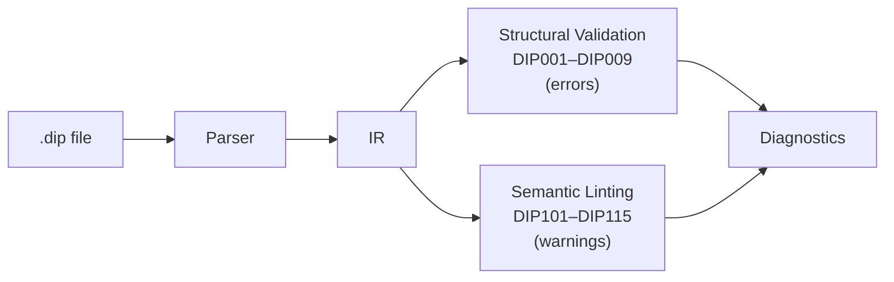

# Validation and Linting Reference

Dippin provides 24 diagnostic checks split into two categories:

- **Structural validation** (DIP001–DIP009): Errors that **must** be fixed. A workflow with any of these cannot execute.
- **Semantic linting** (DIP101–DIP115): Warnings that flag likely bugs or questionable patterns. They don't block execution but should be reviewed.

Run `dippin validate <file>` for structural checks only, or `dippin lint <file>` for both.



---

## Diagnostic Format

Diagnostics are displayed in a rustc-inspired format:

```
error[DIP003]: unknown node reference "InterpretX" in edge
  --> pipeline.dip:45:5
  = help: did you mean "Interpret"?
```

Each diagnostic has:

| Field | Description |
|-------|-------------|
| `Code` | Unique identifier (e.g., DIP003) |
| `Severity` | `error`, `warning`, `info`, or `hint` |
| `Message` | Human-readable explanation of the issue |
| `Location` | File, line, and column where the issue was detected |
| `Help` | Optional suggestion for fixing the issue |
| `Fix` | Optional replacement text |

In JSON output mode (`--format json`), diagnostics are emitted as an array of objects with these exact fields.

---

## Structural Validation Errors (DIP001–DIP009)

### DIP001: Start Node Missing

**Severity**: Error

The workflow must declare a `start:` field pointing to an existing node.

```
error[DIP001]: start node does not exist
  --> pipeline.dip:1:1
  = help: add "start: <NodeID>" to the workflow header
```

**What triggers it**:
- The `start:` field is missing entirely
- The `start:` field references a node ID that doesn't exist

**How to fix**: Add or correct the `start:` field in the workflow header:
```dippin
workflow MyPipeline
  start: FirstNode    # Must match an actual node ID
  exit: LastNode
```

---

### DIP002: Exit Node Missing

**Severity**: Error

The workflow must declare an `exit:` field pointing to an existing node.

```
error[DIP002]: exit node does not exist
  --> pipeline.dip:1:1
  = help: add "exit: <NodeID>" to the workflow header
```

**What triggers it**:
- The `exit:` field is missing entirely
- The `exit:` field references a node ID that doesn't exist

**How to fix**: Add or correct the `exit:` field in the workflow header.

---

### DIP003: Unknown Node Reference in Edge

**Severity**: Error

Every edge's `From` and `To` must reference existing node IDs.

```
error[DIP003]: unknown node reference "InterpretX" in edge
  --> pipeline.dip:45:5
  = help: did you mean "Interpret"?
```

**What triggers it**: An edge references a node that hasn't been declared in the workflow.

**Smart suggestions**: The validator uses Levenshtein distance (edit distance ≤ 2) to suggest corrections for typos.

**How to fix**: Either correct the node name in the edge, or declare the missing node.

---

### DIP004: Unreachable Node from Start

**Severity**: Error

Every node must be reachable from the start node via some path of edges.

```
error[DIP004]: node unreachable from start
  --> pipeline.dip:20:3
  = help: add an edge leading to this node, or remove it
```

**What triggers it**: BFS from the start node cannot reach this node. The node is an island — connected to nothing or only connected to other unreachable nodes.

**How to fix**: Either add edges that connect this node to the main graph, or remove the orphaned node.

---

### DIP005: Unconditional Cycle Detected

**Severity**: Error

The workflow graph must be a DAG (directed acyclic graph), with the exception of restart edges.

```
error[DIP005]: unconditional cycle detected
  --> pipeline.dip:50:5
  = help: remove an edge in this cycle or mark it "restart: true"
```

**What triggers it**: DFS finds a back-edge that is not marked `restart: true`. This means the pipeline would loop forever.

**Important**: Restart edges (`restart: true`) are excluded from cycle detection. They are the intentional mechanism for controlled iteration.

**How to fix**: Either remove an edge to break the cycle, or mark the back-edge as `restart: true` to make it a controlled loop.

---

### DIP006: Exit Node Has Outgoing Edges

**Severity**: Error

The exit node is the terminal — it must have zero outgoing edges.

```
error[DIP006]: exit node has outgoing edges
  --> pipeline.dip:55:5
  = help: remove outgoing edges from the exit node
```

**What triggers it**: An edge has the exit node as its `From` field.

**How to fix**: Remove the outgoing edge. If you need processing after the current exit node, make a new exit node.

---

### DIP007: Parallel/Fan-In Mismatch

**Severity**: Error

Every `parallel` node must have a matching `fan_in` node with the same set of branch nodes.

```
error[DIP007]: parallel fan-out/fan-in mismatch
  --> pipeline.dip:15:3
  = help: add a matching fan_in node
```

**What triggers it**:
- A `parallel` node exists without a corresponding `fan_in`
- A `fan_in` node exists without a corresponding `parallel`
- The target/source sets don't match between the pair

**How to fix**: Ensure every `parallel P -> A, B, C` has a matching `fan_in J <- A, B, C` with the same nodes (order doesn't matter).

---

### DIP008: Duplicate Node ID

**Severity**: Error

Node IDs must be globally unique within a workflow.

```
error[DIP008]: duplicate node ID
  --> pipeline.dip:30:3
  = help: rename this node or remove the duplicate
```

**What triggers it**: Two nodes share the same ID.

**How to fix**: Rename one of the duplicate nodes.

---

### DIP009: Duplicate Edge

**Severity**: Error

No two edges may have the same (from, to, condition) combination.

```
error[DIP009]: duplicate edge
  --> pipeline.dip:60:5
  = help: remove the duplicate edge
```

**What triggers it**: Two edges with identical source, target, and condition raw text.

**Note**: Edges with different conditions on the same (from, to) pair are **not** duplicates — that's intentional conditional branching.

---

## Semantic Lint Warnings (DIP101–DIP115)

### DIP101: Node Only Reachable via Conditional Edges

**Severity**: Warning

A node where **all** incoming edges have conditions may be unreachable at runtime if no condition matches.

```
warning[DIP101]: unreachable node after conditional branches
  --> pipeline.dip:25:3
```

**What triggers it**: Every edge leading to this node has a `when` clause. If none of those conditions evaluate to true, execution can never reach this node.

**When it's OK**: If the conditions are exhaustive (cover all possible values), this is a false positive.

**How to fix**: Add an unconditional incoming edge, or verify that the conditions are exhaustive.

---

### DIP102: Routing Node Missing Default Edge

**Severity**: Warning

A node with conditional outgoing edges but no unconditional fallback.

```
warning[DIP102]: routing node has no default/unconditional edge
  --> pipeline.dip:35:3
```

**What triggers it**: A node has one or more outgoing edges with `when` conditions, but no outgoing edge without a condition.

**Why it matters**: If no condition matches at runtime, execution gets stuck — there's no default path to follow.

**How to fix**: Add an unconditional fallback edge:
```dippin
  edges
    Check -> Pass when ctx.outcome = success
    Check -> Retry when ctx.outcome = retry
    Check -> Fail    # unconditional fallback
```

---

### DIP103: Overlapping Conditions

**Severity**: Warning

Multiple edges from the same node test the same variable for the same value.

```
warning[DIP103]: overlapping or contradictory conditions
  --> pipeline.dip:45:5
```

**What triggers it**: Two edges from node A both check `ctx.outcome = success`. One will shadow the other.

**How to fix**: Remove or merge the duplicate condition.

---

### DIP104: Unbounded Retry Loop

**Severity**: Warning

A retry path has no `max_retries` or `fallback_target` to bound it.

```
warning[DIP104]: unbounded retry loop (no max_retries or fallback)
  --> pipeline.dip:40:3
```

**What triggers it**: A node has a `retry_target` set but no `max_retries` or `fallback_target`. This could cause infinite retries.

**How to fix**: Set `max_retries` and/or `fallback_target`:
```dippin
  agent Validate
    max_retries: 3
    retry_target: Implement
    fallback_target: ManualReview
```

---

### DIP105: No Success Path to Exit

**Severity**: Warning

There is no guaranteed path from start to exit through unconditional edges alone.

```
warning[DIP105]: no success path from start to exit
  --> pipeline.dip:1:1
```

**What triggers it**: Every path from start to exit goes through at least one conditional edge. If conditions don't match, execution may never reach the exit.

**How to fix**: Ensure at least one complete path from start to exit uses only unconditional edges or has unconditional fallbacks at every decision point.

---

### DIP106: Undefined Variable in Prompt

**Severity**: Warning

A prompt references a variable that no upstream node is known to produce.

```
warning[DIP106]: undefined variable reference in prompt
  --> pipeline.dip:22:5
```

**What triggers it**: The prompt contains `${ctx.something}` or `${params.key}` where `something` is not a reserved key and no upstream node declares it in `writes`.

**How to fix**: Either add the key to an upstream node's `writes`, or verify the variable name is correct.

---

### DIP107: Unused Context Write

**Severity**: Warning

A node produces a context key that no downstream node reads.

```
warning[DIP107]: unused context key (written but never read)
  --> pipeline.dip:18:5
```

**What triggers it**: A node declares `writes: summary` but no downstream node has `reads: summary` or references `${ctx.summary}` in its prompt.

**How to fix**: Remove the unused `writes` declaration, or add a downstream consumer.

---

### DIP108: Unknown Model/Provider

**Severity**: Warning

The model or provider isn't in the engine's recognized list.

```
warning[DIP108]: unknown model/provider combination
  --> pipeline.dip:15:5
```

**What triggers it**: A model or provider string doesn't match any known LLM provider.

**How to fix**: Check for typos. Use recognized model/provider combinations.

---

### DIP109: Namespace Collision in Imports

**Severity**: Warning

A subgraph parameter name conflicts with an existing context key.

```
warning[DIP109]: namespace collision in imports
  --> pipeline.dip:28:5
```

**What triggers it**: A `subgraph` node's `params` map contains a key that shadows an existing context variable.

**How to fix**: Rename the parameter to avoid the collision.

---

### DIP110: Empty Prompt on Agent

**Severity**: Warning

An agent node has no prompt text.

```
warning[DIP110]: empty prompt on agent node
  --> pipeline.dip:12:3
```

**What triggers it**: An agent node is defined without a `prompt` field or with an empty prompt.

**Why it matters**: An agent without a prompt won't produce meaningful output.

**How to fix**: Add a prompt, or change the node kind if it doesn't need one.

---

### DIP111: Tool Without Timeout

**Severity**: Warning

A tool node has no `timeout` field.

```
warning[DIP111]: tool command has no timeout
  --> pipeline.dip:35:3
```

**What triggers it**: A tool node defines a `command` but no `timeout`.

**Why it matters**: Without a timeout, a hanging command blocks the pipeline indefinitely.

**How to fix**: Add a timeout:
```dippin
  tool RunTests
    timeout: 60s
    command:
      pytest
```

---

### DIP112: Reads Key Not Produced Upstream

**Severity**: Warning

A node declares a `reads` key that no upstream node produces.

```
warning[DIP112]: reads key not produced by any upstream writes
  --> pipeline.dip:25:3
```

**What triggers it**: A node has `reads: plan` but no node upstream (reachable via incoming edges from start) declares `writes: plan`.

**How to fix**: Either add the key to an upstream node's `writes` or remove it from `reads`.

---

### DIP113: Invalid Retry Policy Name

**Severity**: Warning

A node or workflow default specifies a `retry_policy` value that is not a recognized policy name.

```
warning[DIP113]: node "analyze" has retry_policy "agressive" which is not a recognized policy name
  --> pipeline.dip:15:3
  = help: valid policies: standard, aggressive, patient, linear, none
```

**Valid policies**:

| Policy | Backoff | Description |
|--------|---------|-------------|
| `standard` | Exponential | Default. 3 attempts, exponential backoff from base delay |
| `aggressive` | Exponential | More attempts, shorter initial delay |
| `patient` | Exponential | Fewer attempts, longer delays between retries |
| `linear` | Linear | Fixed delay between attempts |
| `none` | — | No retries (node fails immediately on error) |

**How to fix**: Check for typos. Use one of the five recognized policy names.

---

### DIP114: Invalid Fidelity Level

**Severity**: Warning

A node or workflow default specifies a `fidelity` value that is not a recognized level.

```
warning[DIP114]: node "analyze" has fidelity "sumary:high" which is not a recognized level
  --> pipeline.dip:12:3
  = help: valid levels: full, summary:high, summary:medium, summary:low, compact, truncate
```

**Valid fidelity levels**:

| Level | Context Injected | Use Case |
|-------|-----------------|----------|
| `full` | Complete context from all prior nodes | Default for first execution |
| `summary:high` | All keys + trimmed artifacts (2000 chars/node) | Reduce context for large pipelines |
| `summary:medium` | Key decisions only (outcome, last_response, human_response) | Moderate context reduction |
| `summary:low` | One-line summary per completed node | Minimal context |
| `compact` | Only workflow goal + current outcome | Near-zero context |
| `truncate` | Medium keys capped at 500 chars each | Hard size limit |

**Degradation on resume**: When a pipeline resumes from checkpoint, fidelity degrades one level (e.g., `full` → `summary:high`).

**How to fix**: Check for typos. Use one of the six recognized levels.

---

### DIP115: Goal Gate Without Recovery Path

**Severity**: Warning

A node has `goal_gate: true` but no `retry_target` or `fallback_target`, meaning the pipeline has no recovery path if the gate fails.

```
warning[DIP115]: node "validate_tests" has goal_gate: true but no retry_target or fallback_target
  --> pipeline.dip:18:3
  = help: add retry_target or fallback_target so the pipeline can recover when the gate fails
```

**What `goal_gate` means**: When a node with `goal_gate: true` completes with `outcome != success`, the pipeline fails at exit — even if the exit node itself succeeded. Goal gates enforce invariants (e.g., "all tests must pass").

**How to fix**: Add `retry_target: <node>` to retry from an earlier point, or `fallback_target: <node>` to route to a recovery path.

---

## Running Validation

### Structural validation only

```bash
dippin validate pipeline.dip
```

Runs DIP001–DIP009. Exit code 0 if all pass, 1 if any errors.

### Full lint (validation + semantic)

```bash
dippin lint pipeline.dip
```

Runs all DIP001–DIP009 errors and DIP101–DIP115 warnings. Exit code 1 only for errors; warnings alone exit 0.

### JSON output for CI

```bash
dippin --format json lint pipeline.dip
```

Emits diagnostics as a JSON array for machine consumption.
